# 🚗 PriceMyRide PL: Car Valuation Engine


## 📌 Project Overview

This repository contains an end-to-end machine learning project focused on predicting used car prices in the Polish automotive market. The objective is to develop a **production-ready pricing engine** capable of estimating the market value of a vehicle based on its technical specifications, usage characteristics, and market context.

The model leverages vehicle attributes such as brand, model, production year, mileage, engine parameters, and equipment features to generate accurate price predictions. By analyzing patterns in historical market data, the system captures complex relationships between vehicle characteristics and their corresponding market prices.

The solution is designed to support **data-driven decision-making** for both professional dealerships and private sellers — enabling competitive listing price estimation, depreciation trend analysis, and identification of key value drivers in the used car market.

This project demonstrates a complete **machine learning workflow**: data preprocessing, feature engineering, model development, hyperparameter optimization, and detailed model evaluation with error analysis. The final model is built using gradient boosting and optimized to provide reliable predictions across a wide range of vehicle types and price segments.

**Project pipeline stages:**

1. **Data loading & preprocessing** — collect, load, and clean raw vehicle listings from Polish online car sales platforms.
2. **Exploratory Data Analysis (EDA)** — analyze feature distributions, detect anomalies and outliers, generate visual insights.
3. **Feature engineering** — handle missing values, encode categorical variables, create derived features, remove extreme outliers.
4. **Model experimentation** — evaluate multiple approaches: Ridge baseline → Random Forest → optimized XGBoost.
5. **Hyperparameter tuning** — apply **Optuna** (Bayesian search) to identify optimal model configurations.
6. **Evaluation & validation** — assess performance using **RMSE, MAE, MAPE, and R²** with residual analysis.
7. **Error analysis and model refinement** — investigate prediction errors, identify problematic segments, engineer corrective features.
8. **Deployment** — serialize the model to **Hugging Face Hub**, build an interactive **Streamlit dashboard**, containerize with **Docker**.

---

## 🚀 Live Demo & Models

### 🖥️ Streamlit Dashboard
**[Launch App →](https://cars-price-prediction-in-poland-93x3kme8tvdopec5f4vxul.streamlit.app/)**

### 🤗 Hugging Face Model Registry
**[View Models on Hugging Face →](https://huggingface.co/Przemsonn/poland-car-price-model)**

---

## 📚 Table of Contents
1. [Dataset](#-dataset)
2. [Data Collection & Updates](#-data-collection--updates)
3. [Project Structure](#-project-structure)
4. [Workflow Steps](#-workflow-steps)
5. [Results & Business Impact](#-results--business-impact)
6. [Tech Stack](#️-tech-stack)
7. [Installation & Usage](#-installation--usage)
8. [Docker](#-docker)
9. [Future Work](#-future-work)

---

## 📁 Dataset

The dataset is stored in `data/Car_sale_ads_balanced.csv` and contains **~200,000 active car listings** scraped from Otomoto (Poland's largest automotive marketplace). The dataset covers **current market prices (2024–2026)**, collected via a stratified scraping pipeline across 35 brand/fuel-type segments to ensure broad coverage of popular, luxury, and electric vehicles.

Key fields include:

| Category | Fields |
|----------|--------|
| Vehicle information | `brand`, `model`, `year`, `mileage` |
| Technical specs | `fuel_type`, `power_hp`, `type`, `transmission`, `displacement_cm3`, `colour`, `origin_country`, `doors_number`, `first_owner`, `condition` |
| Pricing | `price_PLN` (target, Polish Złoty) |
| Offer details | `offer_publication_date` |
| Text attributes | `features`, `offer_location` |

> **Note:** Only active Otomoto listings are scraped — prices reflect the current Polish car market (2024–2026). No historical or pre-2022 data is used.

---

## 🔄 Data Collection & Updates

### Data Source

Listings are collected from **[Otomoto](https://www.otomoto.pl)** — the largest Polish automotive marketplace — using a custom scraping pipeline built on `requests` and `BeautifulSoup`. The pipeline parses the `__NEXT_DATA__` JSON embedded in Otomoto search pages, which yields up to 32 structured listing records per request without requiring a browser.

> **Historical data note:** Otomoto only exposes *active* listings. Ads from 2021–2024 that are no longer live cannot be scraped retroactively. The original 200,000-row dataset covers that period and remains the training foundation. The update pipeline is designed for **incremental enrichment** going forward.

### Collected Fields

| Raw Otomoto Field | Schema Column | Notes |
|-------------------|---------------|-------|
| `make` | `Vehicle_brand` | Direct |
| `model` | `Vehicle_model` | Direct |
| `version` / `generation` | `Vehicle_generation` | Combined |
| `year` | `Production_year` | Numeric |
| `mileage` | `Mileage_km` | Parsed from "55 005 km" |
| `engine_capacity` | `Displacement_cm3` | Parsed from "1 984 cm3" |
| `engine_power` | `Power_HP` | Parsed from "272 KM" |
| `fuel_type` | `Fuel_type` | Polish → English translation |
| `gearbox` | `Transmission` | Polish → English translation |
| `transmission` | `Drive` | Polish → English translation |
| `body_type` | `Type` | Polish → English translation |
| `door_count` | `Doors_number` | Numeric |
| `color` | `Colour` | Polish → English translation |
| `new_used` | `Condition` | Polish → English translation |
| `country_origin` | `Origin_country` | Polish → English translation |
| `original_owner` | `First_owner` | Binary (0/1) |
| `price` | `price_PLN` | PLN; EUR converted via NBP API |
| `createdAt` | `Offer_publication_date` | dd/mm/yyyy |
| `location.city` | `Offer_location` | City name |
| equipment keys | `Features` | Comma-separated feature labels |

### Update Mechanism

The pipeline performs **incremental updates**: only listings whose Otomoto offer ID is not already present in the dataset are appended. This prevents duplicate records across runs.

```bash
# Fetch ~320 new listings (10 pages × 32)
python main.py --mode update --pages 10

# Full detail mode — fetches individual listing pages for Drive, Colour, etc.
python main.py --mode update --pages 5 --detail

# Test with synthetic data (no network required)
python main.py --mode update --mock
```

You can also run updates programmatically:

```python
from src.data_fetcher import fetch_incremental

new_rows = fetch_incremental(
    data_path="data/Car_sale_ads_balanced.csv",
    pages=20,            # ~640 listings
    detail_mode=True,    # fetch full field coverage
)
print(f"Appended {len(new_rows)} new listings")
```

### Rate Limiting & Robustness

- Random delay between requests (1.5–3.5 s) to avoid triggering rate limits
- Automatic retry with exponential back-off on HTTP 429/5xx responses
- Graceful degradation: scraping failures are logged and skipped, not fatal

### Stratified / Balanced Collection

A plain incremental scrape over-represents common brands (Volkswagen, Toyota, Opel)
and under-represents rare but analytically important segments (luxury brands, electric
vehicles). The `--mode collect` pipeline addresses this by fetching each segment
separately, then resampling to a target distribution.

**Segment allocation (default `--target-rows 120000`):**

| Segment | Filter | Target share | Examples |
|---------|--------|:------------:|----------|
| Popular brands | per-brand make filter | 65 % | VW, Toyota, BMW, Audi, Skoda … |
| Luxury / rare | per-brand make filter | 15 % | Porsche, Ferrari, Bentley, Maserati … |
| Electric vehicles | `fuel_type=electric` | 20 % | Tesla, BMW i, VW ID, Hyundai IONIQ … |

> Luxury and EV categories have fewer than ~4 000 Otomoto listings each.
> Available rows are used in full; popular brands fill the remaining quota.

```bash
# Collect 120 000 balanced listings (long-running, ~5–8 hours)
python main.py --mode collect --target-rows 120000

# Full detail coverage (adds Drive, Colour, body type via individual page fetches)
python main.py --mode collect --target-rows 120000 --detail

# Dry run with synthetic data (instant, tests the full pipeline)
python main.py --mode collect --target-rows 120000 --mock
```

Programmatic usage:

```python
from src.data_fetcher import fetch_balanced_dataset, STRATIFIED_CONFIG
from src.data_cleaning import clean_data, apply_stratified_sampling, validate_schema

# 1. Fetch across all segments
df_raw = fetch_balanced_dataset(target_rows=120_000)

# 2. Normalize and clean
df_clean = clean_data(df_raw.drop(columns=["_category"]))

# 3. Balance final dataset
df_balanced = apply_stratified_sampling(df_clean, target_rows=120_000,
                                         electric_frac=0.20, luxury_frac=0.15)

# 4. Validate schema
result = validate_schema(df_balanced)
print(result["valid"], result["issues"])

# 5. Save
df_balanced.to_csv("data/Car_sale_ads_balanced.csv", index=False)
```

Output is saved to `data/Car_sale_ads_balanced.csv` by default.

---

## 📂 Project Structure

```
├── data/
│   ├── Car_sale_ads_balanced.csv     # primary dataset: ~200k scraped Otomoto listings (2024-2026)
├── images/
├── models/
├── notebooks/
├── reports/
│   └── model_evaluation_report.txt
├── src/
│   ├── __init__.py
│   ├── config.py
│   ├── data.py
│   ├── data_cleaning.py      # normalize_columns(), clean_data(), deduplicate(),
│   │                         # validate_schema(), apply_stratified_sampling()
│   ├── data_fetcher.py       # fetch_data(), fetch_incremental(),
│   │                         # fetch_balanced_dataset(), STRATIFIED_CONFIG
│   ├── evaluation.py
│   ├── features.py
│   ├── models.py
│   ├── preprocessing.py
│   ├── utils.py
│   └── visualization.py
├── .gitignore
├── app.py
├── Dockerfile
├── docker-compose.yml
├── LICENSE
├── main.py
├── requirements.txt
└── README.md
```

The `src/` directory contains modular, production-ready scripts that mirror the notebook experiments. `main.py` orchestrates the full pipeline end-to-end. `app.py` is the Streamlit application serving the final model. `Dockerfile` and `docker-compose.yml` enable fully containerized deployment without any local dependency setup.

---

## 🔁 Workflow Steps

### 🗂 Data Loading

The raw dataset is loaded from CSV using `pandas.read_csv` within `src/data.py`. This module centralizes data loading logic, making the dataset consistently accessible across preprocessing, analysis, and training stages. Centralizing this logic also ensures that any future data source changes require modifications in only one place.

---

### 🔧 Data Preprocessing & Quality Assessment

This stage addresses missing values, outliers, data types, and currency standardization while carefully avoiding data leakage. The quality of this step directly determines the ceiling for model performance — garbage in, garbage out applies strongly in pricing models where a single corrupted record (e.g., a price entered in the wrong currency without conversion) can distort predictions for an entire vehicle segment.

Key preprocessing steps:
- **Missing value handling** — median imputation for numerical features (robust to outliers), mode for categorical (preserves the most common market context)
- **Outlier detection** — identified and flagged extreme values in price, mileage, and power; listings with implausible combinations (e.g., 5-year-old car with 900,000 km mileage) were removed as data entry errors
- **Type casting** — ensured consistent dtypes across features before pipeline construction to prevent silent type coercion errors during transformation
- **Currency standardization** — all prices converted to PLN via NBP API; using official exchange rates rather than a fixed approximation ensures the model learns from price relationships that reflect actual purchasing power

> All preprocessing logic is encapsulated in `src/preprocessing.py` and executed as part of the scikit-learn pipeline to prevent data leakage between train and test sets.

---

### 🔍 Exploratory Data Analysis (EDA)

Comprehensive exploratory analysis was conducted to understand the dataset structure, distributions, and key patterns before modeling. The EDA directly informed feature engineering decisions and model selection.

#### Price Distribution & Depreciation

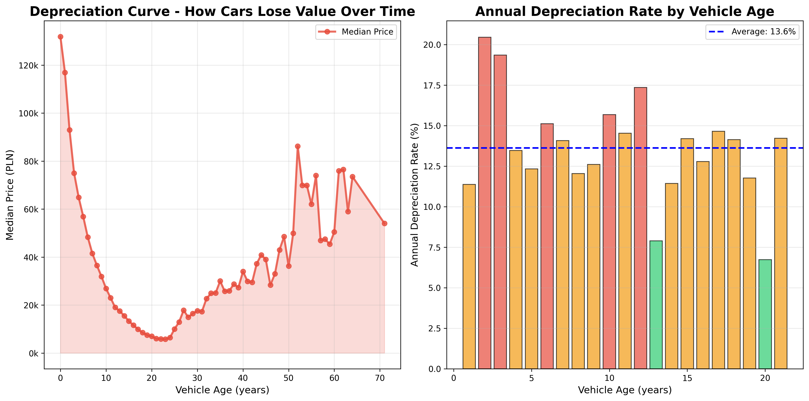

The depreciation curve above plots median vehicle price against production year, revealing three structurally distinct phases in how cars lose value over time.

**Key Insights:**
- **Rapid early depreciation:** ~50% of value lost within the first 5 years — confirms the need for non-linear modeling. This steep initial drop is driven by the transition from "new" to "used" status, warranty expiry, and the first major service intervals. A linear model fundamentally cannot capture this shape.
- **Stable decline:** Between 5–25 years, depreciation follows a consistent downward trend as accumulated mileage and wear become the primary pricing factors, smoothing out brand and segment differences.
- **Classic car effect:** Vehicles older than 25 years show price stabilization or slight increases (collectible/vintage transition), introducing a non-monotonic relationship that required dedicated feature engineering to handle.
- **Log transformation recommended** due to right-skewed price distribution — the long tail of luxury and collectible vehicles would otherwise dominate training loss and cause the model to underfit the mass-market segment that represents the majority of listings.

---

#### Feature Relationships: Key Predictors vs Price

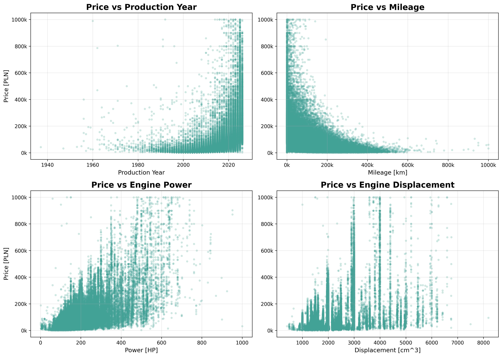

The scatter plots above show the raw relationship between the four strongest numerical predictors and the target price, before any transformation. Each relationship exhibits clear non-linearity, validating the decision to move beyond linear modeling.

| Feature | Relationship | Key Finding |
|---------|-------------|-------------|
| Production Year | Strong positive | Sharp increase post-2015; 2020+ vehicles carry significant premium driven by near-new inventory scarcity during the semiconductor crisis |
| Mileage | Strong negative | Lower mileage = higher price; the relationship is exponential at low mileage (0–30k km) and flattens at very high mileage — most critical depreciation predictor |
| Power (HP) | Positive | Strongest numerical predictor; linear up to ~300 HP, then extreme variance as the luxury and supercar segment introduces brand premium effects that HP alone cannot capture |
| Displacement (cm³) | Moderate positive | Less linear than HP; modern turbocharged engines decouple displacement from performance, making this feature less informative for post-2015 vehicles |

**Modeling impact:** All four features are strong candidates for polynomial features and interaction terms, as their relationships with price are clearly non-linear. The fan-shaped scatter patterns also suggest heteroscedastic variance — another argument for log-transforming the target.

---

#### Interaction Effects: Mileage × Age × Segment

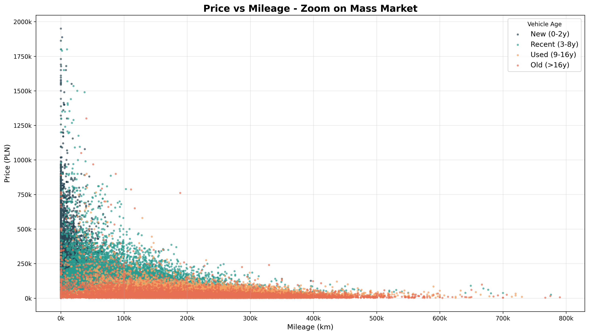

The plot above colors each listing by vehicle age group, revealing that the mileage-price relationship is not universal — it changes dramatically across lifecycle stages. A young car with 50,000 km is priced very differently from a 12-year-old car with the same mileage, even though the raw mileage value is identical. This interaction is one of the most practically important insights from the EDA.

| Age Segment | Mileage Range | Price Range | Notes |
|-------------|--------------|-------------|-------|
| New (<3 years) | 0–20,000 km | 50k–1M PLN | Demo vehicles show slight mileage at premium |
| Recent (3–8 years) | <100,000 km | 50k–300k PLN | Premium brands retain value despite higher mileage |
| Used (9–16 years) | 50k–300k km | <200k PLN | Mass-market segment dominates |
| Old (>16 years) | up to 400k+ km | <50k PLN | Exceptions for vintage/collectible vehicles |

This finding directly motivated the creation of the `age_mileage_interaction` and `mileage_per_year` engineered features described in the Feature Engineering section.

---

#### Fuel Type Price Evolution

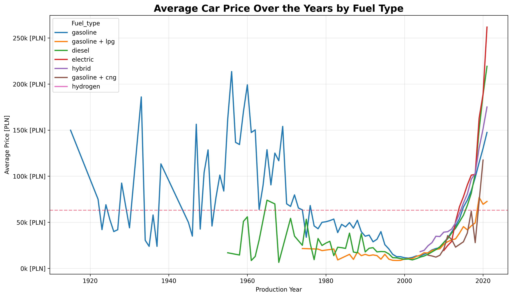

The time series above shows average listing price by fuel type across production years, highlighting how different powertrains have tracked different market trajectories. This is particularly relevant for the model because fuel type is not just a technical classification — it also proxies vehicle era, buyer intent, and expected total cost of ownership.

**Key Insights:**
- **Electric vehicles:** Sharp price increase post-2010 reflects both battery technology maturation and a shift from budget EVs to premium positioning (Tesla effect)
- **Hybrid:** Moderate growth in mid-range segment — increasingly present in fleet and family vehicle categories
- **Diesel & Gasoline:** Steady historical increase with some divergence post-2018 as diesel face regulatory headwinds in European markets, including Poland
- **CNG & LPG:** Minimal growth in the cost-sensitive, high-mileage driver segment

Fuel type's inclusion as a feature goes beyond capturing technical differences — it embeds temporal and market-segment information that complements production year and price range.

---

#### Correlation Analysis

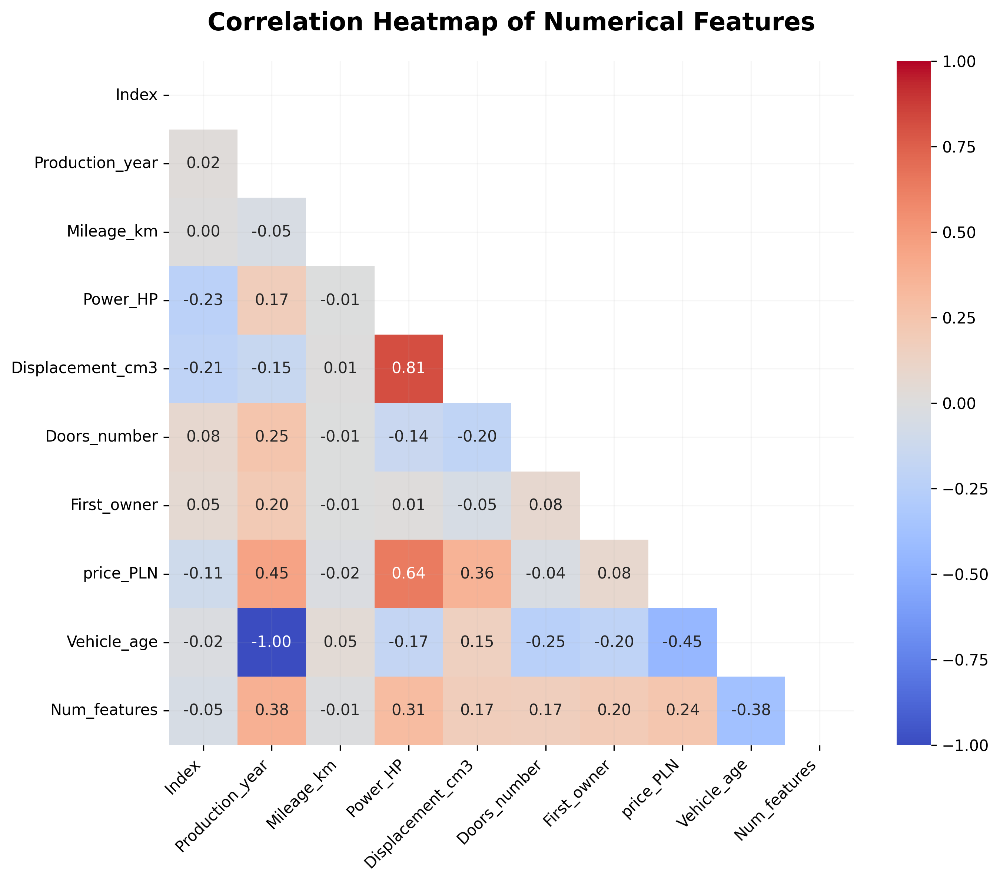

The heatmap above quantifies linear relationships between all numerical features and price, and also highlights multicollinearity between predictors — an important diagnostic for deciding which features to engineer, combine, or remove.

**Notable correlations with price:**
- `Power_HP`: **+0.64** — strongest numerical predictor; reflects the well-documented relationship between engine output and vehicle segment
- `Production_year`: **+0.45** — newer = more expensive; partially redundant with `Vehicle_age` (correlation = -0.99 between the two)
- `Vehicle_age`: **-0.45** — the moderate (not strong) negative correlation confirms the non-linear depreciation finding from EDA — old vehicles are not uniformly cheap
- `Displacement_cm3`: **+0.36** — engine size matters, but less so for modern turbocharged vehicles

**Engineering decisions informed by this analysis:**
- `HP_per_liter` created to reduce `Power_HP` ↔ `Displacement_cm3` multicollinearity (r = 0.81) — combining them into a single performance ratio preserves information while reducing redundancy
- `Vehicle_age` used instead of `Production_year` (more interpretable, removes redundancy since their correlation = -1.00)
- Polynomial and interaction terms added for moderate correlations to help the model capture non-linear patterns that linear correlation coefficients systematically underestimate

---

### 🔧 Feature Engineering

Feature engineering was one of the most impactful stages of the project. The goal was to translate domain knowledge about the automotive market into representations the model can learn from effectively. Raw features like production year or mileage carry useful information, but the model learns much more efficiently when that information is expressed in terms that match the underlying pricing logic — for example, how many kilometers a car has been driven per year of its life is more directly informative than mileage alone.

#### Domain-Driven Feature Synthesis

| Feature | Type | Description |
|---------|------|-------------|
| `Mileage_per_year`, `Usage_intensity` | Operational | Distinguishes highway vs city usage patterns for same-age vehicles — two cars with identical mileage but different ages represent very different depreciation profiles. `Usage_intensity` is a categorical binning (Low / Medium / High / Very_High) derived from `Mileage_per_year`. |
| `HP_per_liter` | Performance ratio | Captures modern turbo efficiency vs older naturally-aspirated engines; decouples raw displacement from actual performance output |
| `Is_premium`, `Is_supercar` | Binary flags | Brand prestige and power thresholds — signals luxury pricing dynamics that cannot be learned from continuous technical specs alone |
| `is_collector` | Binary flag | Vintage vehicles where rarity drives value more than utility; prevents the model from applying standard depreciation logic to cars where the pricing mechanism is fundamentally different |
| `Age_category` | Segmentation | Lifecycle stages: New / Standard / Old / Vintage — encodes the structural phases identified in the EDA depreciation curve into an explicit categorical signal |
| `Brand_tier` | Market segment | Five-tier brand classification (Ultra_Luxury / Luxury / Premium / Mass_Market / Niche) used for sample weighting and as a categorical feature — captures price-level differences driven by brand positioning |
| `Rarity_index`, `Brand_popularity` | Market context | `Rarity_index` is a log-normalized inverse of brand frequency; `Brand_popularity` is a categorical binning (Popular / Common / Uncommon / Rare / Ultra_Rare) — helps the model differentiate pricing dynamics for under-represented brands |

#### Non-Linear & Interaction Features

- **Polynomial terms:** Squared `vehicle_age`, `power_hp`, `mileage_km` — captures the accelerating early depreciation curve and the premium escalation at high HP values that linear terms cannot represent. Without these, the model would systematically underestimate both the price of new low-mileage cars and the depreciation rate in the first 3–5 years.
- **Interaction terms:** `age_mileage_interaction`, `power_age_interaction` — reflects how the combined effect of these variables differs across segments. A high-mileage car is penalized much more if it is also old, and a high-power car retains more of its premium when it is young.
- **Log transforms:** Applied to highly skewed features (`mileage_km`, `power_hp`, `displacement_cm3`) to stabilize variance and reduce the disproportionate influence of extreme values on gradient-based learning.

#### Preprocessing Pipeline

```
ColumnTransformer (base XGBoost)
├── Numerical → Median imputation (SimpleImputer)
└── Categorical → Constant imputation ("missing") → OrdinalEncoder

ColumnTransformer (tuned XGBoost)
├── Numerical → StandardScaler
├── Low-cardinality categorical → OneHotEncoder
└── High-cardinality categorical → TargetEncoder (smoothing=300)
```

The choice of `TargetEncoder` for high-cardinality features like `model` (hundreds of unique values) is deliberate: one-hot encoding would produce a sparse, extremely wide feature matrix, while label encoding loses ordinal meaning. Target encoding replaces each category with a smoothed estimate of the mean target value — effectively teaching the model what each specific brand/model combination is worth on average, without blowing up the feature space. The smoothing factor of 300 prevents overfitting to rare vehicle models represented by very few listings.

> All transformations are fitted **only on training data** and applied to the test set — no data leakage.

---

### 📈 Model Training & Performance

The modeling phase followed an incremental complexity approach — each step was motivated by the limitations of the previous model. Rather than jumping directly to the most complex algorithm, this progression provides interpretable evidence for each architectural decision and establishes a clear performance baseline at each level.

#### Evaluation Metrics — What They Mean for Car Price Prediction

Before diving into model results, it is worth clarifying what each metric actually represents in this business context:

| Metric | Interpretation for Car Pricing |
|--------|-------------------------------|
| **R²** | Proportion of price variance explained by the model. R² = 0.93 means the model accounts for 93% of the variation in prices across all vehicles — the remaining 7% is due to factors not captured in the data (e.g., vehicle history, negotiation, cosmetic condition). |
| **MAE** (Mean Absolute Error) | Average absolute prediction error in PLN. MAE = 12,000 PLN means predictions are off by 12,000 PLN on average — regardless of whether the car costs 20,000 or 200,000 PLN. Intuitive but treats all errors equally regardless of price level. |
| **RMSE** (Root Mean Squared Error) | Similar to MAE but penalizes large errors more heavily due to squaring. RMSE > MAE always; a large gap between the two indicates the model struggles with certain outlier-prone segments (vintage, supercar). |
| **MAPE** (Mean Absolute Percentage Error) | Scale-independent error as a percentage of actual price. MAPE = 18.6% means predictions deviate by ~19% on average relative to the actual price — a 100,000 PLN car would be predicted within ±19,000 PLN. Most business-interpretable metric for comparing across price segments. |

---

#### Model 1 — Ridge Regression (Baseline)

| Metric | Train | Test |
|--------|-------|------|
| R² | 72.7% | 72.4% |
| MAE | 19,247 PLN | 19,355 PLN |
| RMSE | 70,721 PLN | 69,707 PLN |
| MAPE | 28.4% | 28.5% |

The Ridge regression baseline establishes the performance floor and confirms what the EDA already suggested: **car depreciation is not a linear process**. An R² of 72.4% reveals that a linear model can only capture about three quarters of the price variance. The MAE of over 19,000 PLN and MAPE of 28.5% translate to predictions that are commercially unusable — a car worth 50,000 PLN could be priced anywhere between 36,000 and 64,000 PLN. The model fails particularly hard on vehicles at the extremes of the age and price distribution, where the non-linear depreciation curve deviates most from any linear approximation. This baseline serves as a reference floor — every subsequent model is evaluated against this starting point.

---

#### Model 2 — Random Forest

| Metric | Train | Test |
|--------|-------|------|
| R² | 92.2% | 92.2% |
| MAE | 10,064 PLN | 13,097 PLN |
| RMSE | 37,770 PLN | 37,185 PLN |
| MAPE | 17.7% | 22.8% |

Switching to Random Forest delivered substantial gains across all metrics: test MAE dropped by ~32% and MAPE fell from 28.5% to 22.8%. This confirms that **non-linear decision boundaries** are essential for this problem — the model now captures depreciation thresholds (e.g., the sharp price drop when a car crosses 100,000 km or 10 years of age) that Ridge regression missed entirely. The R² of 92.2% represents a meaningful improvement in explained variance (+20 pp). However, the remaining MAPE of 22.8% still represents significant commercial uncertainty — a car priced at 80,000 PLN could be predicted anywhere within a ±18,000 PLN window. The gap between train MAPE (17.7%) and test MAPE (22.8%) suggests mild overfitting. The Random Forest also struggled with luxury and vintage segments where training examples are scarce: without enough examples to form reliable decision trees in those regions, the model defaults to regression toward the mean, systematically underestimating high-value vehicles. This limitation motivated the move to gradient boosting.

---

#### Model 3 — XGBoost (Base) ⭐ Selected for deployment

| Metric | Train | Test |
|--------|-------|------|
| R² | 94.3% | 93.0% |
| RMSE | 32,205 PLN | 35,170 PLN |
| MAE | 9,727 PLN | 11,900 PLN |
| MAPE | 14.8% | 18.6% |

The base XGBoost model achieves the best overall test R² across all models and was selected for production deployment. The test MAE of 11,900 PLN represents a ~38% reduction compared to the Ridge baseline and a ~9% improvement over Random Forest. The MAPE of 18.6% means the model is commercially usable for most vehicle segments — on a 60,000 PLN car, predictions are within approximately ±11,000 PLN on average, which aligns with the natural price spread visible on marketplaces like Otomoto for similar specifications.

Train R² (94.3%) is higher than test R² (93.0%), with a moderate gap that indicates the model generalizes well without significant overfitting. The RMSE gap between train and test (~3,000 PLN) is within normal variance. The train-to-test MAPE difference (14.8% → 18.6%) is modest for a gradient boosting model on heterogeneous price data.

##### XGBoost Feature Importance

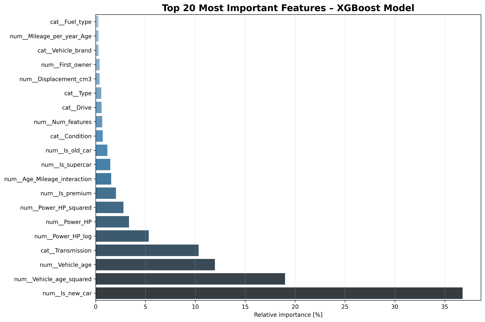

The feature importance chart above shows the relative contribution of each feature to the model's split decisions. Several findings stand out:

- **Is_new_car (41%):** The single most critical predictor. The "new car" binary flag captures the structural price discontinuity between brand-new and used vehicles — a distinction that cannot be expressed continuously through production year or mileage alone. This aligns with the sharp depreciation cliff observed in the EDA.
- **Vehicle_age_squared (21%) + Vehicle_age (8%):** Together, the age-related features account for ~29% of the model's logic, and the squared term outweighs the linear term — direct confirmation that the model has learned the non-linear depreciation curve. Had only linear age been included, this ~21% of predictive power would have been left on the table.
- **Transmission (10%):** Automatic gearboxes carry a consistent premium in the Polish market, particularly in the 3–10 year age bracket. This feature captures both the technical characteristic and the buyer preference signal embedded in it.
- **Engine Power (3–5%):** Relatively modest individual importance, but note that power also contributes indirectly through the `is_supercar`, `hp_per_liter`, and `power_age_interaction` features — the total effect of engine performance on the model is higher than any single feature's importance suggests.

**Why XGBoost outperforms Random Forest here:**
- Sequential boosting focuses correction on residuals from previous trees — particularly effective for the diverse price range in this dataset where high-value vehicles are systematically underestimated by a single-pass ensemble
- More sensitive to the engineered interaction features, which carry gradient signal across multiple splits
- Better handles the log-transformed target variable, as boosting can progressively reduce residuals in both tails of the distribution

---

#### Model 4 — XGBoost (Hyperparameter-Tuned via Optuna)

| Metric | Train | Test |
|--------|-------|------|
| R² | 96.3% | 92.3% |
| MAE | 9,497 PLN | 11,956 PLN |
| RMSE | 25,863 PLN | 36,852 PLN |
| MAPE | 15.6% | 19.3% |

This model was developed as an attempt to push beyond the base XGBoost results by combining hyperparameter optimization with sample weighting and additional feature engineering. Brand-related features — `Brand_tier`, `Rarity_index`, and `Brand_popularity` — were introduced specifically to help the model differentiate pricing dynamics for niche, rare, and luxury manufacturers that appear infrequently in the training data. Sample weights were applied using the five-tier brand system (Ultra_Luxury 4×, Luxury 3×, Niche 3.5×, Premium 1.5×, Mass_Market 1×) to boost under-represented segments. Hyperparameter tuning was performed using Optuna with 80 Bayesian search trials, applying strong regularization via Gamma, Alpha, and Lambda penalties.

Despite improved training metrics (R² 96.3%), test performance deteriorated compared to the base model (R² 92.3% vs 93.0%). The train-test R² gap of ~4 pp suggests mild overfitting — the additional model capacity captured training-set-specific patterns rather than generalizable price signals. The strong regularization penalties and explicit column selection in the preprocessor (StandardScaler + TargetEncoder) reduced the model's ability to leverage the full feature set that the base model's dynamic column selectors captured. The additional brand features may also have introduced noise: brand popularity is a proxy for segment, which was already captured through `is_premium` and `is_supercar` flags.

##### SHAP Feature Importance

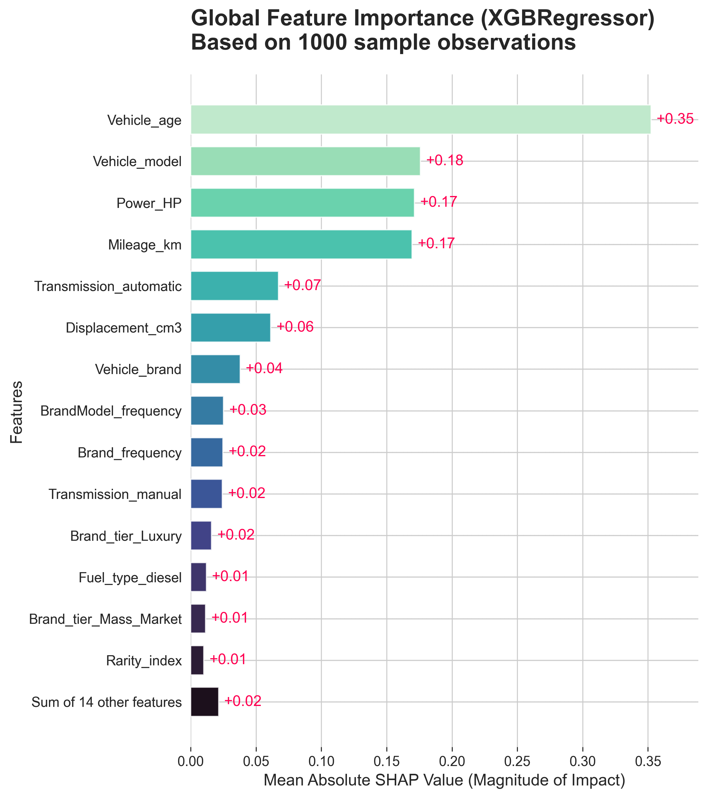

SHAP (SHapley Additive exPlanations) values provide a more theoretically rigorous measure of feature importance than the split-based XGBoost importance shown above. While split importance counts how often a feature is used in tree splits, SHAP quantifies the average magnitude of each feature's contribution to individual predictions — capturing both direct and indirect effects. This makes SHAP particularly useful for validating that the model's behavior aligns with real-world pricing intuition.

The most influential features align with real-world intuition:
- **Vehicle Age** (SHAP ≈ 0.35): Dominant predictor by a significant margin, consistent with the depreciation curve from EDA. The high SHAP value means that knowing a car's age moves the model's price estimate substantially — more than any other single input.
- **Vehicle Model** (SHAP ≈ 0.18): Captures brand and model-specific pricing patterns not visible in aggregate statistics — for example, why a 5-year-old Golf and a 5-year-old Audi A4 are priced differently even at the same mileage and power.
- **Power (HP)** (SHAP ≈ 0.17): Reflects the luxury and performance premium embedded in high-output vehicles. The gap between age and HP confirms that time-based depreciation is the primary pricing mechanism, with technical performance as a secondary modifier.
- **Mileage (km)** (SHAP ≈ 0.17): Strong depreciation signal, nearly tied with Power HP. This reflects the fact that mileage is a direct indicator of vehicle wear that affects pricing independently of age.

Transmission, Displacement, Vehicle Brand, and brand-level features (`BrandModel_frequency`, `Rarity_index`) each contribute measurable SHAP values, confirming that the model uses both technical and market-context features.

**Decision: Base XGBoost (Model 3) selected** — best predictive accuracy with stable generalization. The tuned model's additional complexity did not translate to real-world performance gains on this dataset.

---

#### 🛠 Error Analysis

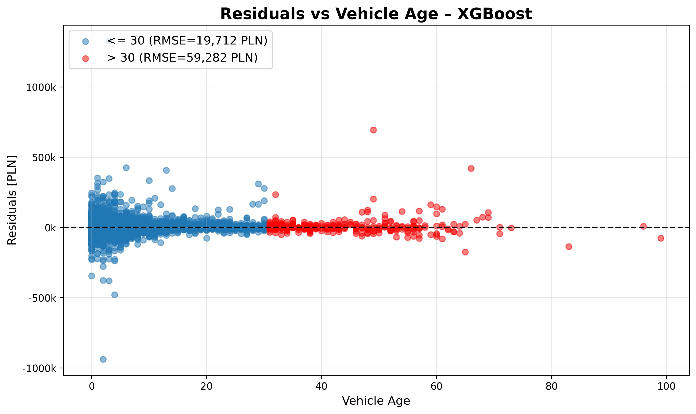

The residual plot above shows prediction errors broken down by production year. Mass-market vehicles produced between 2000 and 2021 show low, symmetric residuals centered near zero — the model performs consistently well across this dominant segment. The most visible error concentration appears for vehicles at the extremes of the production year range.

The largest prediction errors occur for:
- **Vintage vehicles (pre-1980):** RMSE ~59,301 PLN — approximately 3× higher than for newer cars. These vehicles are priced by rarity, collector demand, and restoration quality rather than technical specifications, which cannot be fully captured from structured data alone. The model has limited training examples in this range, and the features used (age, mileage, power) carry a fundamentally different meaning for collector vehicles than they do for utility cars.
- **Luxury & supercar segment** (Lamborghini, Aston Martin, Rolls-Royce): Underrepresented in training data at fewer than 0.5% of all listings. The model tends to underestimate prices in this category, as it has insufficient examples to learn the brand prestige multiplier at extreme price points.

Mass-market vehicles (VW, Toyota, Opel, Škoda) remain well-predicted with low residuals across the full mileage and age range. These niche segments were **intentionally retained** rather than removed — excluding them would artificially inflate metrics without improving real-world utility. The application correctly warns users when a predicted vehicle falls into a high-uncertainty category, providing appropriate transparency about prediction confidence.

---

#### 📊 Learning Curves

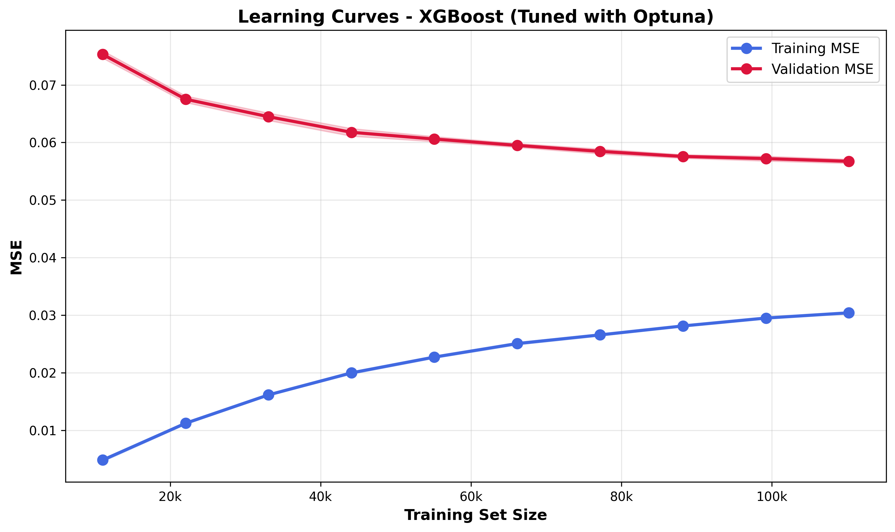

The learning curves above plot training and validation performance as a function of training set size. They serve as a diagnostic tool for understanding whether the model would benefit from more data or whether architectural changes are needed.

The curves confirm a healthy bias–variance balance:
- Training and validation curves converge smoothly — minimal overfitting gap at the full training set size
- The gap between curves narrows steadily as training set size increases — stable learning behavior with no sign of divergence
- A plateau is visible beyond ~150,000 samples — additional data alone is unlikely to substantially improve performance without introducing new feature types, such as NLP-derived features from listing descriptions. This suggests the model has extracted most of the available signal from the current feature set.

---

#### 🏁 Model Comparison

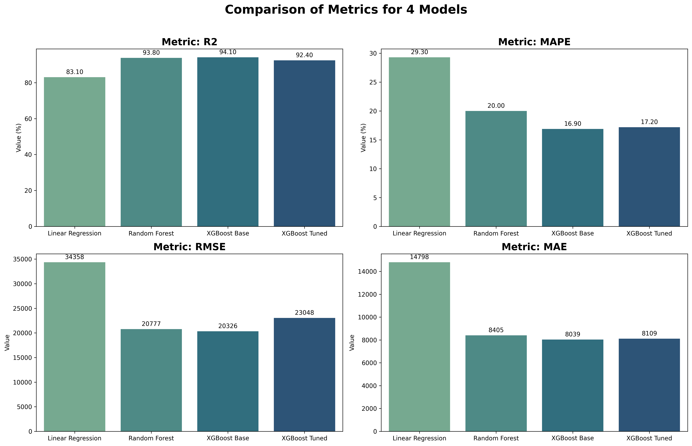

| Model | R² (Test) | MAE (Test) | MAPE (Test) | Decision |
|-------|-----------|------------|-------------|----------|
| Ridge Regression | 72.4% | 19,355 PLN | 28.5% | ❌ Baseline only |
| Random Forest | 92.2% | 13,097 PLN | 22.8% | ✅ Strong but surpassed |
| **XGBoost Base** | **93.0%** | **11,900 PLN** | **18.6%** | ⭐ **Selected** |
| XGBoost Tuned | 92.3% | 11,956 PLN | 19.3% | ⚠️ Slightly worse |

**Conclusions:**

The progression from Ridge Regression to XGBoost Base tells a clear story about this problem's nature. The 20+ percentage point jump in R² from linear to tree-based models confirms that non-linearity is not an optional enhancement — it is a fundamental requirement for modeling vehicle depreciation. The move from Random Forest to XGBoost delivered a further improvement in MAE (13,097 → 11,900 PLN) and a significant drop in MAPE (22.8% → 18.6%), with the gradient boosting framework's ability to iteratively correct residuals proving particularly valuable for the wide price range present in this dataset.

The Tuned XGBoost result is the most instructive: despite 80 optimization trials, sample weighting, and additional brand-level feature engineering, test performance regressed slightly across all metrics (R² 92.3% vs 93.0%). This is a reminder that hyperparameter tuning is not a guaranteed improvement — when a model already generalizes well, the combination of strong regularization and explicit feature selection can reduce its capacity to fit legitimate signal. The base XGBoost configuration found the right balance between bias and variance without needing aggressive penalization.

For practical deployment, a MAPE of 18.6% and MAE of ~11,900 PLN means the model is well-suited for mass-market vehicle valuation (cars in the 20,000–150,000 PLN range) and can serve as a strong pricing signal for dealerships and private sellers alike. The residual 18.6% error reflects a mix of true model uncertainty, the inherent noise in online listing prices (negotiation margins, seller motivation), and the unmodeled quality of individual vehicles.

---

## 🚀 Deployment

- **Model Serialization:** Final model saved with `joblib.dump` and hosted on Hugging Face Hub for versioned storage and reproducibility.
- **Streamlit App:** Users input vehicle specs and receive real-time price predictions, vehicle summary stats, and a direct Otomoto search link for comparable listings.
- **Deployment:** Streamlit Community Cloud (live link at the top of this README).
- **Docker:** The full application is containerized for reproducible local deployment — see the [Docker section](#-docker) below.
- **Evaluation report:** Key metrics and model diagnostics saved as `reports/model_evaluation_report.txt`.

### Application Interface

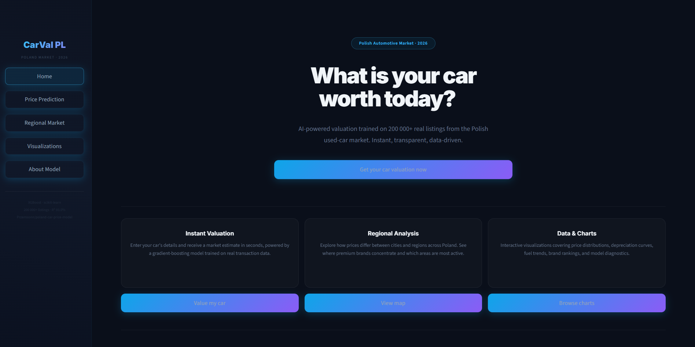

The application is structured into **five pages** accessible via the sidebar navigation. Each page is designed around a specific user goal — from quick valuation to deep analytical exploration.

#### 🏠 Home

The landing page provides an overview of the entire project and acts as a navigation hub.

| Section | Content |
|---------|---------|
| **Headline** | Tagline, brief description, and a call-to-action button linking to the valuation form. |
| **Feature Cards** | Three glass-styled cards summarising the main capabilities: Instant Valuation, Regional Analysis, and Data & Charts. Each card links to the corresponding page. |
| **Model Performance** | Four metric tiles displaying the production model's key results: R² (93.0%), RMSE (35 170 PLN), MAE (11 900 PLN), and MAPE (18.6%). |
| **About the Project** | Five-paragraph description covering the full data science lifecycle: data collection from Otomoto, model architecture comparison (Ridge → Random Forest → XGBoost), feature engineering strategy (41 features from 14 raw inputs), and dataset characteristics (200 000+ listings, 2024–2026 prices). |
| **Tech Stack Cards** | Three cards highlighting the core technology areas: Machine Learning (XGBoost, Optuna, scikit-learn), Data Pipeline (custom scraper, Pandas, NumPy), and Deployment (Streamlit, Docker, Hugging Face Hub). |

---

#### 🔮 Price Prediction

The main valuation tool — users fill out a structured form and receive an instant price estimate.

| Section | Content |
|---------|---------|
| **Vehicle Identity** | Brand (60+ brands), Model (free text), Condition (Used/New), Production Year (slider 1915–current), Colour, Country of Origin. |
| **Engine & Mechanics** | Mileage (slider 0–1 000 000 km), Power (slider 10–1 500 HP), Displacement (slider 0–8 000 cm³), Fuel Type (7 options incl. Electric, Hybrid), Transmission (Manual/Automatic), Body Type (9 categories). |
| **Additional Information** | First Owner flag, Door count, Location (city), and a free-text field for equipment/features (comma-separated). |
| **Result Card** | Displays the predicted price in PLN with an estimated ±15% confidence range. Below the card: vehicle age, annual mileage, specific power (HP/L), and market segment tier. |
| **Otomoto Link** | Auto-generated search URL filtered by brand, model, year range, and price range — opens Otomoto directly with comparable listings. |
| **Segment Warning** | Displayed for ultra-luxury, vintage (>30 years), or high-performance (>500 HP) vehicles where model accuracy is reduced. |

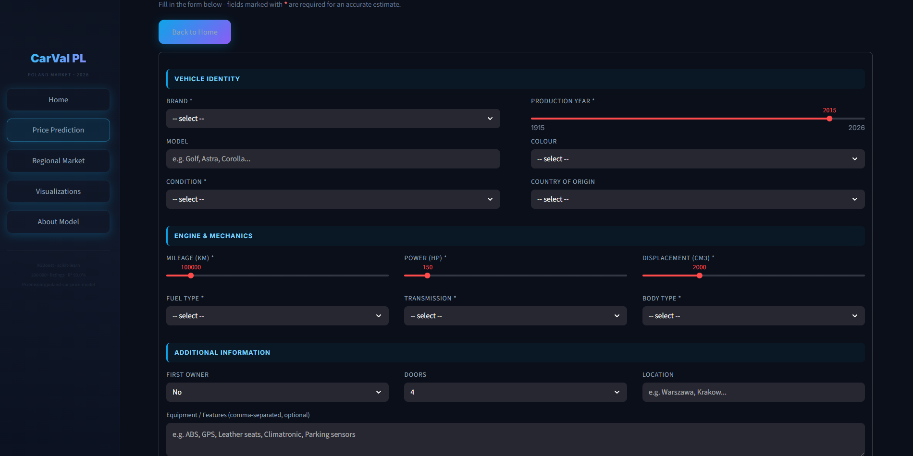

---

#### 🗺️ Regional Market

Interactive geographic analysis of listing distribution across Poland.

| Section | Content |
|---------|---------|
| **Interactive Map** | A Folium dark-themed map with circle markers for 30 Polish cities. Circle size and colour encode the number of listings (green → yellow → orange → red). |
| **Top 10 Bar Chart** | Plotly bar chart ranking the 10 cities with the most listings, coloured by listing count. |
| **Urban vs Rural** | Insight card noting that major cities (Warszawa, Kraków, Wrocław) account for over 60% of all listings, with premium brands concentrating in urban centres. |
| **Regional Trends** | Insight card covering geographic price patterns: higher prices in western Poland, German-import preference in coastal cities, budget-segment dominance in eastern regions. |

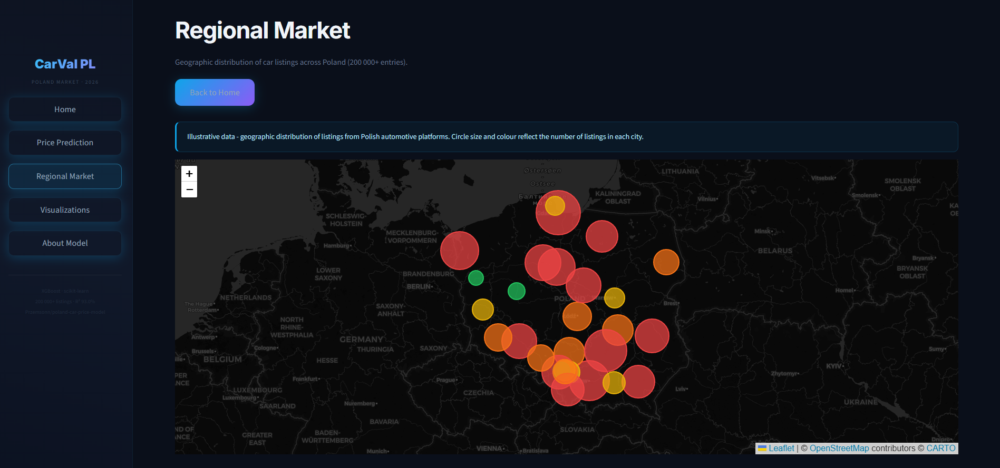

---

#### 📊 Visualizations

The most content-rich page, organised into **three tabs** with a total of 12 charts and 8 business insights. Every chart includes an introductory paragraph above and a detailed analytical conclusion below.

**Tab 1 — EDA Insights** (6 charts):

| Chart | Description |
|-------|-------------|
| **Price Distribution** | Raw and log-transformed price histograms. Explains right-skewness, the median vs mean gap, and why log transformation is essential for training. |
| **Value Depreciation Over Time** | Median price vs vehicle age curve. Covers the three depreciation phases: rapid early loss (40–50% in 3 years), stable mid-life decline, and the vintage/collector price recovery after 25 years. |
| **Mileage vs Price by Vehicle Age** | Scatter plot with four age cohorts. Demonstrates how the same mileage value carries different pricing implications across age groups, justifying the Age_Mileage_interaction feature. |
| **Median Price — Top 20 Brands** | Horizontal bar chart ranking brands by median listing price. Shows the ~2× gap between German premium brands and the mass-market cluster, and Volkswagen's unique position spanning both segments. |
| **Price Trends by Fuel Type** | Time series of average price by fuel type across production years. Highlights the EV price surge post-2010, hybrid growth, diesel-gasoline divergence post-2018, and the LPG discount pattern. |
| **Correlation Heatmap** | Numerical feature correlation matrix. Identifies the strongest predictors (Power_HP r=0.60, Vehicle_age r=-0.45) and multicollinearity patterns that guided feature engineering decisions. |

**Tab 2 — Model Analysis** (6 charts):

| Chart | Description |
|-------|-------------|
| **SHAP Feature Importance** | Mean absolute SHAP values for the XGBoost model. Vehicle Age dominates (~0.55), followed by Power HP (~0.18), Vehicle Model (~0.15), and Mileage (~0.12). |
| **XGBoost Split-Based Importance** | Tree split frequency analysis. Is_new_car (41%) captures the new/used price cliff; Vehicle_age_squared (21%) confirms non-linear depreciation learning; Transmission (10%) reflects the automatic gearbox premium. |
| **Error Analysis by Vehicle Age** | Residuals plotted by production year. Confirms tight calibration for 2000–2021 mass-market vehicles and identifies the two high-error segments: pre-1980 vintage (RMSE ~59k PLN) and modern supercars. |
| **Learning Curves** | Training vs validation performance as a function of dataset size. Shows smooth convergence with a plateau beyond ~150 000 samples, indicating the feature set's information ceiling. |
| **Model Comparison** | Side-by-side metrics for Ridge, Random Forest, XGBoost Base, and XGBoost Weighted. Explains why Base XGBoost was selected (best test MAPE at 18.6%) despite the tuned variant's stronger training metrics. |
| **Actual vs Predicted Prices** | Scatter plot of predicted vs true prices. Confirms excellent mass-market accuracy along the diagonal and increasing scatter above 300 000 PLN due to limited luxury training data. |

**Tab 3 — Business Insights** (8 insight cards):

| Insight | Key Takeaway |
|---------|-------------|
| **The First 3 Years Are the Most Expensive** | 40–50% value loss in years 1–3; buying a 3–4 year old vehicle offers the best value proposition. |
| **The German Premium Tax** | Mercedes, BMW, Audi carry a 60–80% median price premium over equivalent mass-market vehicles. |
| **Automatic Transmission Premium** | 8–15% price uplift for automatic gearboxes, strongest in SUVs and premium sedans. |
| **Electric Vehicles Hold Value Differently** | Lower depreciation in years 1–5 but faster decline after year 8 due to battery concerns; sweet spot at 3–6 years. |
| **Location Matters** | 10–20% price variation between cities for the same vehicle; sellers in smaller cities benefit from national platform listings. |
| **The 100 000 km Barrier** | Psychological price drop exceeding the linear mileage-price relationship; listing before this threshold preserves 5–8% of value. |
| **Equipment Lists Add Value** | Listings with 10+ features sell at 8–12% higher prices; comprehensive descriptions are free and directly impact valuation. |
| **When to Trust the Model** | Highest accuracy (MAPE < 15%) for mass-market vehicles aged 3–15 years with 30k–200k km; use expert appraisal for luxury/vintage segments. |

---

#### 🧠 About Model

Technical documentation of the model architecture, designed for users who want to understand the methodology.

| Section | Content |
|---------|---------|
| **Model Overview** | Brief description of the XGBoost pipeline and its purpose. |
| **Why XGBoost?** | Comparison table (Ridge vs Random Forest vs XGBoost) with key advantages: sequential boosting, robustness to noise, fast inference, L1/L2 regularisation. |
| **Feature Set** | Full list of 41 features split into 14 raw inputs and 27 engineered features, with descriptions for each derived feature. |
| **Final Results** | R² 93.0%, RMSE 35 170 PLN, MAE 11 900 PLN, MAPE 18.6% — with plain-language interpretations. |
| **Training Pipeline** | Seven-step process: data collection → preprocessing → feature engineering → model selection → hyperparameter tuning → validation → deployment. |
| **Limitations** | Explicit accuracy boundaries: best for mass-market (100–300 HP, 50–200k km, 2010–2024); reduced for luxury, vintage, and rare models. |
| **Tech Stack** | XGBoost 2.0, scikit-learn, Optuna, Pandas, Streamlit, Docker, Hugging Face Hub, Plotly, Folium. |

---

### Example Prediction — Hyundai i20

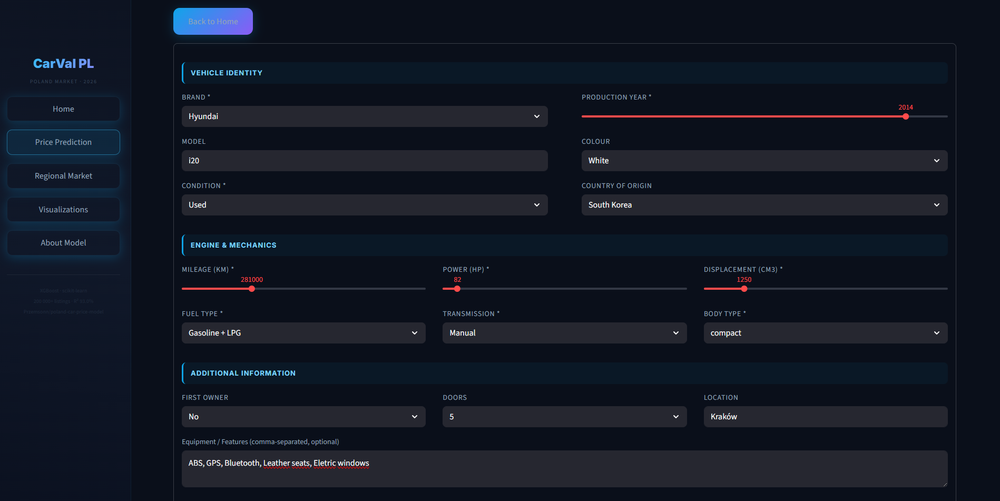

Comparable vehicles on the Polish market (similar year, mileage, power) typically sell between **16,000–21,000 PLN**. The model's prediction falls within this range, confirming strong performance for mass-market vehicles.

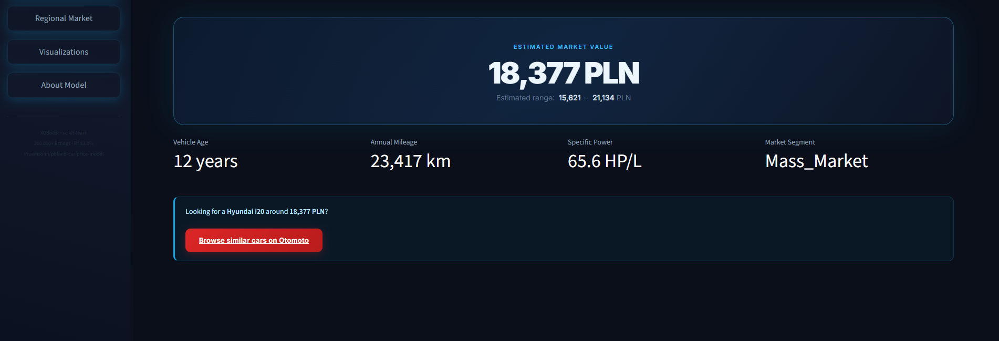

---

### Example Prediction — Mercedes-Benz C-Class

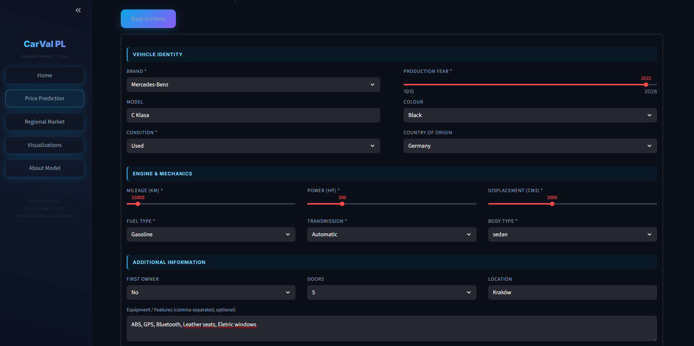

The model estimates approximately **131,200 PLN** — consistent with current Otomoto listings for comparable C-Class specifications from around 2022.


The Otomoto link is automatically generated with filters matching the predicted vehicle's adjusted year, mileage range, and price range — allowing users to immediately validate the prediction against real market listings.

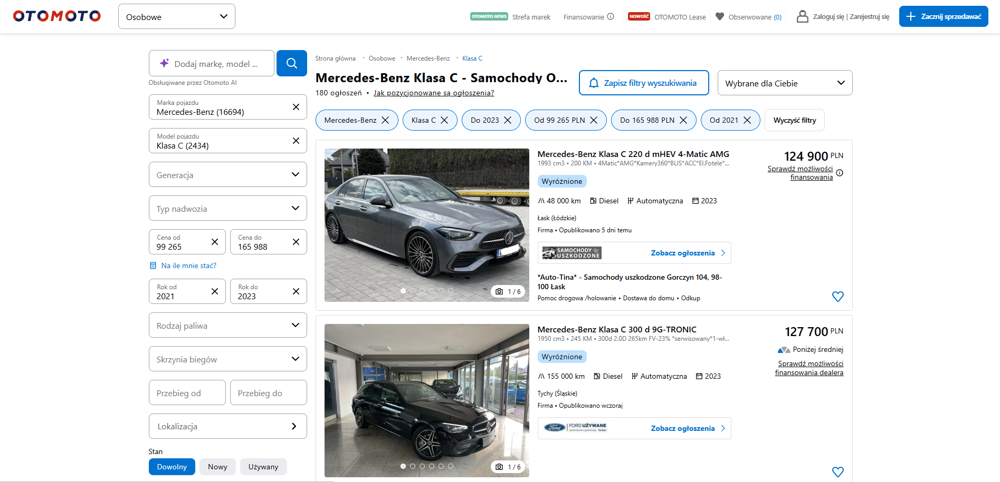

---

## 📊 Results & Business Impact

**Base XGBoost (Model 3)** was selected for deployment due to its best predictive accuracy and stable generalization across diverse vehicle segments.

| Improvement vs Baseline | Value |
|-------------------------|-------|
| MAE reduction | **38.5%** (19,355 → 11,900 PLN) |
| MAPE reduction | **34.7%** (28.5% → 18.6%) |
| R² improvement | +20.6 pp (72.4% → 93.0%) |

**Business applications:**
- **Dealership pricing:** Automated competitive price estimation at scale — reduces manual appraisal time and introduces consistency across valuation teams
- **Inventory valuation:** Consistent, data-driven vehicle appraisal across large fleets — replaces reliance on individual appraiser intuition
- **Depreciation forecasting:** Informs purchase timing and resale strategy decisions by quantifying expected value loss over time
- **Marketplace integration:** Architecture is REST API-ready for integration into listing platforms, enabling real-time price suggestions at the moment of listing creation

---

## 🛠️ Tech Stack

| Category | Tools |
|----------|-------|
| ML & modeling | XGBoost, scikit-learn, category-encoders |
| Optimization | Optuna (Bayesian hyperparameter search) |
| Data processing | Pandas, NumPy |
| Visualization | Matplotlib, Seaborn, Plotly |
| Geospatial | Folium, streamlit-folium |
| Deployment | Streamlit, Hugging Face Hub |
| Containerization | Docker, Docker Compose |
| Serialization | Joblib |
| External APIs | NBP (currency conversion) |

---

## 📥 Installation & Usage

1. **Clone the repository:**
   ```bash
   git clone https://github.com/Przemsonn05/Car-Price-Prediction.git
   cd Car-Price-Prediction
   ```

2. **Install dependencies:**
   ```bash
   pip install -r requirements.txt
   ```

3. **Run the full pipeline (optional — model is pre-trained on Hugging Face):**
   ```bash
   python main.py
   ```

4. **Launch the Streamlit app:**
   ```bash
   streamlit run app.py
   ```

5. Inspect `notebooks/` for step-by-step experiment documentation and exploratory analysis.

---

## 🐳 Docker

The project is fully containerized using Docker, enabling reproducible deployment without any local Python environment setup. The image is built on `python:3.11-slim` and runs the Streamlit app as a non-root user (`myuser`) for security. The layer order in the `Dockerfile` is intentional — `requirements.txt` is installed before the application code is copied, so Docker's build cache is preserved between code changes and rebuilds take seconds rather than minutes.

### Prerequisites

- [Docker](https://docs.docker.com/get-docker/) installed and running
- [Docker Compose](https://docs.docker.com/compose/install/) (included with Docker Desktop on Windows/macOS)

### Running with Docker Compose (recommended)
```bash
# Build the image and start the container
docker compose up --build

# Open the app at http://localhost:8501
```

The `--build` flag is only needed on the first run or after modifying `requirements.txt` or the `Dockerfile`. On subsequent runs:
```bash
docker compose up
```

To stop and remove the container:
```bash
docker compose down
```

### Running with Docker directly
```bash
docker build -t car-price-prediction .
docker run -p 8501:8501 car-price-prediction
```

### Volumes and environment

The `docker-compose.yml` mounts two local directories into the container:

| Host path | Container path | Purpose |
|-----------|---------------|---------|
| `./data`    | `/app/data`    | Scraped dataset (`Car_sale_ads_balanced.csv`) |
| `./reports` | `/app/reports` | Model evaluation output |

The pre-trained model is downloaded from Hugging Face Hub at startup — no local model file is required. An internet connection is needed on first launch.

> **Note:** The `models/`, `images/` and `notebooks/` directories are excluded from the image via `.dockerignore` to keep the image size minimal.

---

## 🔮 Future Work

- **Continuous retraining:** Use the new incremental data pipeline to periodically retrain on fresh Otomoto listings, keeping the model aligned with current market conditions without manual data collection.
- **NLP features:** Use Polish-language BERT to extract pricing signals from listing descriptions (e.g., detecting AMG packages, accident history mentions, special equipment not captured in structured fields).
- **Ensemble strategies:** Experiment with stacking XGBoost alongside LightGBM or CatBoost for potentially lower MAPE on outlier segments, particularly vintage and luxury vehicles where gradient boosting's residual correction could be amplified through a meta-learner.
- **REST API:** Wrap the model in a FastAPI endpoint for integration into dealer platforms and automated listing tools — enabling programmatic access beyond the Streamlit UI.
- **CI/CD pipeline:** Add GitHub Actions for automated retraining when new data becomes available, with quality gates that prevent degraded models from being promoted to production.

---

<div align="center">

**⭐ If you found this project helpful, please star the repository!**

[](https://github.com/Przemsonn05/PriceMyRide-PL-Car-Valuation-Engine)

</div>
