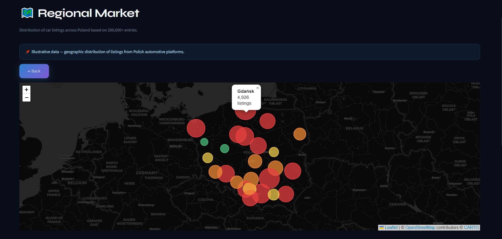
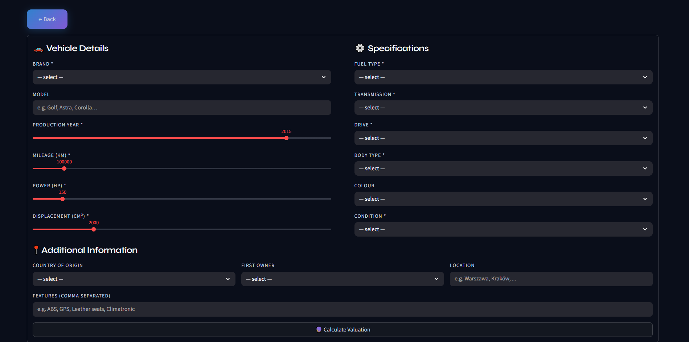
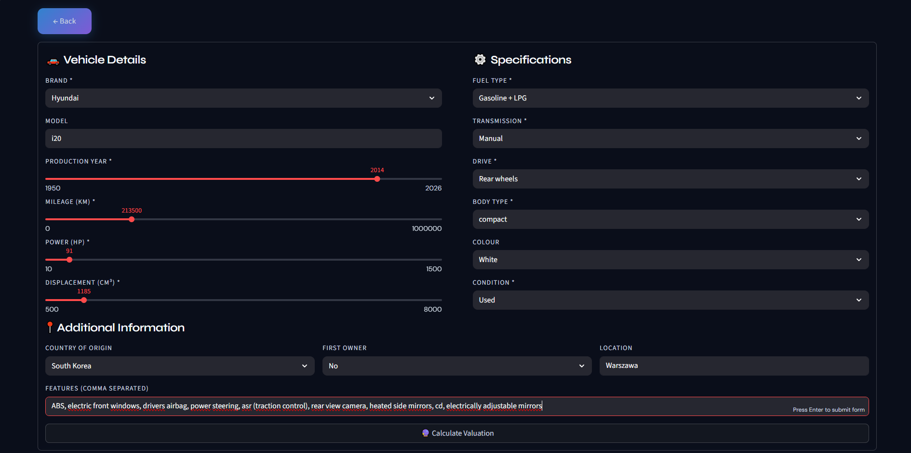
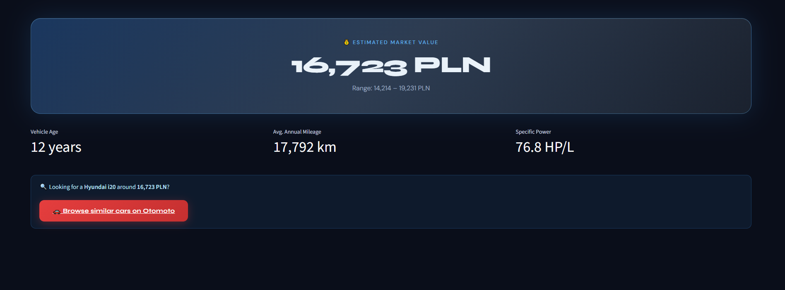
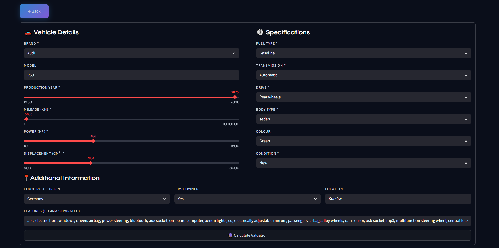
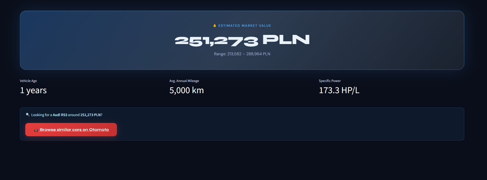
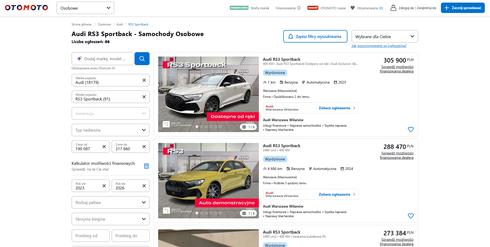

# 🚗 Car Price Prediction in Poland


## 📌 Project Overview
This repository contains an end-to-end machine learning project focused on predicting used car prices in the Polish automotive market. The objective of the project is to develop a **production-ready pricing engine** capable of estimating the market value of a vehicle based on its technical specifications, usage characteristics, and market context.

The model leverages a variety of vehicle attributes such as brand, model, production year, mileage, engine parameters, and equipment features to generate accurate price predictions. By analyzing patterns present in historical market data, the system is able to capture complex relationships between vehicle characteristics and their corresponding market prices.

The solution is designed to support **data-driven decision-making** for both professional dealerships and private sellers. It can be used as a tool for quickly estimating competitive listing prices, understanding depreciation trends, and identifying key factors that influence vehicle valuation in the used car market.

This project demonstrates a complete **machine learning workflow**, including data preprocessing, feature engineering, model development, hyperparameter optimization, and detailed model evaluation with error analysis. The final model is built using advanced gradient boosting techniques and is optimized to provide reliable predictions across a wide range of vehicle types and price segments.

The project workflow follows a structured machine learning pipeline consisting of the following stages:

1. **Data loading & preprocessing** – collect, load, and clean raw vehicle listings obtained from Polish online car sales platforms.

2. **Exploratory Data Analysis (EDA)** – analyze feature distributions, detect anomalies and outliers, and generate visual insights to better understand the structure of the dataset.

3. **Feature engineering** – handle missing values, encode categorical variables, create derived features (such as vehicle age or power-to-displacement ratio), and remove extreme outliers that could negatively affect model training.

4. **Model experimentation** – evaluate multiple modeling approaches, starting with a baseline linear model, followed by tree-based ensemble methods, and ultimately an optimized **XGBoost regressor**.

5. **Hyperparameter tuning** – apply **Optuna** to efficiently search the hyperparameter space and identify optimal model configurations.

6. **Evaluation & validation** – assess model performance using standard regression metrics such as **RMSE, MAE, MAPE, and R²**, complemented by residual analysis and diagnostic visualizations.

7. **Error analysis and model refinement** – investigate prediction errors, identify problematic segments, and create new features to help the model better capture complex pricing relationships.

8. **Deployment & delivery** – serialize the trained model and publish it to **Hugging Face**, develop an interactive **Streamlit dashboard** for price prediction, and organize the workflow into reproducible scripts.

## 🚀 Live Demo & Models

### 🖥️ Streamlit Dashboard
Explore the interactive application to predict car prices in real time:
**[Launch App](https://cars-price-prediction-in-poland-93x3kme8tvdopec5f4vxul.streamlit.app/)**

### 🤗 Hugging Face Model Registry
Due to file size constraints, the trained models are hosted on the Hugging Face Hub:
**[View Models on Hugging Face](https://huggingface.co/Przemsonn/poland-car-price-model)**

---

## 📚 Table of Contents
1. [Dataset](#dataset)
2. [Project Structure](#project-structure)
3. [Workflow Steps](#workflow-steps)
   * [Data Ingestion](#data-ingestion)
   * [Preprocessing & Cleaning](#preprocessing--cleaning)
   * [Exploratory Data Analysis](#exploratory-data-analysis)
   * [Feature Engineering](#feature-engineering)
   * [Model Training & Baselines](#model-training--baselines)
   * [Optimization & Tuning](#optimization--tuning)
   * [Evaluation](#evaluation)
   * [Deployment](#deployment)
4. [Results & Business Impact](#results--business-impact)
5. [Tech Stack](#tech-stack)
6. [Installation & Usage](#installation--usage)
7. [Future Work](#future-work)

---

## 📁 Dataset

The raw dataset is stored in `data/Car_sale_ads.csv` and contains **over 200,000 vehicle listings** scraped from popular Polish automotive marketplaces.

The dataset includes a wide range of attributes describing vehicle specifications, usage, and market context. Key fields include:

* **Vehicle information:** `brand`, `model`, `year`, `mileage`
* **Technical specifications:** `fuel_type`, `power_hp`, `type`, `transmission`, `displacement_cm3`, `colour`, `origin_country`, `doors_number`, `first_owner`, `condition`
* **Pricing information:** `price` (target variable, expressed in PLN or EUR), `currency`
* **Registration / offer details:** `registration_date`, `offer_publication_date`
* **Text-based attributes:** `features` and `offer_location`, which may contain additional signals affecting vehicle price (e.g., optional equipment or regional market differences)

The `notebooks/` directory contains Jupyter notebooks used for **exploratory data analysis (EDA)** and early-stage experimentation, including the main analysis notebook `cars_price_prediction.ipynb`.

---

## 📂 Project Structure
```
├── data/               
│   └── Car_sale_ads.csv
├── images/             
├── notebooks/
├── reports/
│   ├── model_evaluation_report.txt
├── src/               
│   ├── config.py
│   ├── data.py  
│   ├── evaluation.py  
│   ├── features.py  
│   ├── models.py        
│   ├── preprocessing.py  
│   ├── utils.py       
│   └── visualization.py    
├── .gitignore   
├── app.py  
├── LICENSE
├── main.py          
├── requirements.txt  
└── README.md          
```

---

## 🔁 Workflow Steps
Each stage of the project is documented below, along with the corresponding code files and notebooks used during development.

### 🗂 Data Loading

The data ingestion stage initializes the environment and prepares the dataset for further analysis and modeling.

At this step, all required Python libraries for data processing, visualization, and machine learning are imported to ensure a consistent development environment.

The raw dataset is then loaded from the CSV file using `pandas.read_csv` within the `src/data.py` module. This script centralizes the data loading logic, allowing the dataset to be easily accessed and reused across different parts of the project pipeline, including exploratory analysis, preprocessing, and model training.

---

### 🔧 Data Preprocessing & Quality Assessment

Data preprocessing ensures data quality, consistency, and prepares the dataset for feature engineering. This stage addresses missing values, outliers, data types, and currency standardization while carefully avoiding data leakage.

#### 💱 Currency Standardization

**Challenge:** The dataset contains prices in multiple currencies (PLN, EUR, USD).

**Solution:** All prices are converted to PLN using official exchange rates from the National Bank of Poland (NBP) API.

---

### 🔍 Exploratory Data Analysis (EDA)

Comprehensive exploratory analysis was conducted to understand the dataset structure, distributions, and key patterns before modeling. The analysis revealed critical insights about the Polish used car market.

#### 📊 Target Variable Analysis: Price Distribution

Understanding price depreciation patterns is crucial for accurate predictions.


**Key Insights:**

- **Rapid early depreciation:** Vehicles lose approximately 50% of their value within the first 5 years.
- **Stable decline period:** Between 5–25 years, depreciation follows a consistent downward trend.
- **Classic car effect:** Vehicles older than 25 years show price stabilization or slight increases, indicating a transition into the collectible/vintage segment.
- **Peak depreciation rate:** Occurs between years 2–3 of ownership (highest annual loss).
- **Lowest depreciation:** Around 13 years of age, depreciation stabilizes at 11–15% annually.

**Implications for modeling:** Log transformation is recommended due to the right-skewed distribution and wide price range.

---

#### 🔢 Feature Relationships: Key Predictors vs Price

Analysis of the four most important numerical features reveals strong predictive patterns.


**Key Insights:**

**1. Price vs Production Year**
- Clear upward trend: newer vehicles command higher prices.
- Sharp increase post-2015 due to modern technology, safety systems, and market demand.
- Vehicles from 2020+ show a significant price premium.

**2. Price vs Mileage**
- Strong inverse relationship: lower mileage = higher price.
- High concentration around 180,000 km with wide price dispersion.
- Variation is driven by brand, condition, and vehicle segment.
- A critical predictor for depreciation modeling.

**3. Price vs Power (HP)**
- Positive correlation: higher horsepower = higher price.
- High-performance vehicles (>500 HP) show extreme price variance.
- The strongest numerical predictor identified.
- Reflects luxury level, brand prestige, and rarity.

**4. Price vs Engine Displacement (cm³)**
- Common engine sizes: 1,600–2,000 cm³, 3,000 cm³, and 4,000 cm³.
- Generally a positive relationship, but less linear than HP.
- Large engines (7,000 cm³) appear in American SUVs and supercars.
- Displacement alone does not capture performance due to turbocharging effects.

**Modeling impact:** Strong candidates for polynomial features and interaction terms.

---

#### 🎯 Interaction Effects: Mileage × Age × Segment

Examining how multiple features jointly influence price reveals complex patterns.


**Key Insights by Vehicle Age:**

**New Cars (<3 years)**
- Smallest group in the dataset.
- Clustered around 0–20,000 km.
- Wide price range: 50,000–1,000,000 PLN.
- Demo vehicles show slight mileage with premium pricing (200,000–500,000 PLN).

**Recent Cars (3–8 years)**
- Mileage typically below 100,000 km.
- Broad price distribution: 50,000–300,000 PLN.
- Premium brands retain high value despite higher mileage.
- Some supercars exceed 300,000 PLN even with age.

**Used Cars (9–16 years)**
- Mileage range: 50,000–300,000 km.
- Prices rarely exceed 200,000 PLN.
- Clear negative mileage–price relationship.
- The mass-market segment dominates.

**Old Cars (>16 years)**
- Highest mileage (up to 400,000+ km).
- Prices generally below 50,000 PLN.
- Exceptions: vintage and collectible vehicles.

**Modeling implications:** 
- Strong interaction between `Vehicle_age`, `Mileage_km`, and `Brand`.
- Tree-based models are ideal for capturing non-linear relationships.
- Segment-specific patterns require dedicated feature engineering.

---

#### ⚡ Categorical Features: Fuel Type Evolution

Analyzing price trends across fuel types reveals market shifts and technological adoption.


**Key Insights:**

**Historical Trends (1920s–1990s)**
- Gasoline dominated production.
- Gradual price fluctuations across decades.
- Diesel gained popularity in the 1980s–90s (slightly lower prices).

**Modern Era (2000–2010)**
- Structured price differentiation by fuel type emerged.
- Diesel was positioned for fuel efficiency.
- Gasoline remained the standard choice.

**Recent Shift (2010–present)**
- **Electric vehicles:** Sharp price increase (premium positioning, battery costs, technology).
- **Hybrid:** Moderate growth (mid-range segment).
- **Diesel & Gasoline:** Steady increase.
- **CNG & LPG:** Minimal growth (cost-sensitive segment).

**Feature interactions identified:**
- Fuel type × Production year (electric = newer).
- Fuel type × Brand (electric = premium brands).
- Fuel type × Power (performance variants).

**Modeling impact:** TargetEncoder is recommended for high-cardinality categorical variables.

---

#### 🔗 Correlation Analysis: Feature Dependencies

The correlation heatmap reveals multicollinearity and predictive relationships.


**Key Findings:**

**Strong Positive Correlations:**
- `Power_HP` ↔ `Displacement_cm3`: **0.81** (expected: larger engines = more power)
- `Price` ↔ `Power_HP`: **0.58** (high-performance = expensive)
- `Price` ↔ `Production_year`: **0.52** (newer = pricier)

**Strong Negative Correlations:**
- `Production_year` ↔ `Vehicle_age`: **-0.99** (redundant: age = 2026 − year)
- `Price` ↔ `Vehicle_age`: **-0.45** (older = cheaper, moderate due to vintage cars)

**Moderate Correlations:**
- `Price` ↔ `Displacement_cm3`: **0.44** (engine size matters, but not linearly)
- `Number_of_features` ↔ `Vehicle_age`: **-0.38** (newer cars = better equipped)

**Weak Correlations:**
- `Price` ↔ `Doors_number`: **-0.25** (minimal impact)

**Important Notes:**
- Correlation **≠** feature importance (tree models capture non-linear patterns).
- Moderate correlation (0.4–0.6) is still valuable for prediction.
- `Production_year` and `Vehicle_age` are redundant → remove one.

**Feature engineering decisions:**
- Create `HP_per_liter` to reduce `Power_HP` ↔ `Displacement_cm3` multicollinearity.
- Use `Vehicle_age` instead of `Production_year` (more interpretable).
- Consider polynomial and interaction terms for moderate correlations.

---

#### 📋 EDA Summary

Overall, the Exploratory Data Analysis phase provided a comprehensive understanding of the dataset's structure, distributions, and underlying relationships between variables. By examining both numerical and categorical features, it was possible to identify key patterns influencing vehicle prices, detect anomalies and outliers, and evaluate potential sources of noise within the data.

The analysis also revealed important interactions between variables such as vehicle age, mileage, engine power, and fuel type, which play a significant role in determining market value. In addition, correlation analysis and visual exploration highlighted features with strong predictive potential, guiding the selection of variables that could contribute meaningfully to the modeling process.

---

### 🔧 Feature Engineering

To capture the complex, non-linear dynamics of the automotive market, a robust feature engineering strategy and automated preprocessing pipeline were implemented. The goal was to transform raw categorical and numerical data into high-signal inputs while maintaining strict separation between training and test sets to prevent **data leakage**.

#### 1. Domain-Driven Feature Synthesis

Several new features were engineered to better represent vehicle depreciation, performance, and market positioning:

- **Operational Metrics**  
  - `mileage_per_year` and `usage_intensity` distinguish between "highway cruisers" and "city-driven" vehicles of the same age.

- **Performance Ratios**  
  - `hp_per_liter` (specific power) captures differences between high-performance modern engines and older, less efficient ones.

- **Market Segmentation (Heuristics)**  
  - `is_premium` & `is_supercar`: Binary flags based on brand prestige and power thresholds.  
  - `is_collector`: Identifies vintage vehicles where value is driven by rarity rather than utility.  
  - `age_category`: Discretizes vehicle age into lifecycle stages (New, Standard, Old, Vintage).

---

#### 2. Non-Linear & Interaction Modeling

Since car prices do not depreciate linearly, mathematical transformations were applied to assist the XGBoost regressor:

- **Polynomial Features**  
  - Squared terms for `vehicle_age`, `power_hp`, and `mileage_km` capture accelerating depreciation in early years.

- **Interaction Terms**  
  - `age_mileage_interaction` and `power_age_interaction` reflect how the effect of high mileage or power changes depending on vehicle age.

- **Logarithmic Scaling**  
  - Applied `log(x + 1)` transformations to highly skewed features (e.g., price, mileage, power — shown in the EDA section) to stabilize variance and reduce the influence of extreme outliers.

---

#### 3. Automated Preprocessing & Encoding Pipeline

A `ColumnTransformer` pipeline was designed to handle diverse data types with tailored strategies:

- **Numerical Imputation**  
  - Median imputation for missing technical specifications, ensuring robustness to outliers.

- **Categorical Encoding**  
  - *OneHotEncoder*: Applied to low-cardinality features (e.g., `fuel_type`, `transmission`) to avoid imposing an artificial order.  
  - *Target Encoding with Smoothing*: Used for high-cardinality features like `vehicle_model`. A smoothing factor of 500 prevents the model from overfitting to rare models with few observations.

- **Standardization**  
  - Continuous features were scaled using `StandardScaler` to improve convergence for gradient boosting.

---

#### 4. Data Integrity & Leakage Prevention

- **Temporal Consistency**  
  - Rows with irrecoverable data (missing target or critical identifiers) were removed before splitting.

- **Pipeline Isolation**  
  - All transformations (imputation, scaling, encoding) were **fitted only on the training set** and then applied to the test set, ensuring a valid, unbiased evaluation of model performance.

This approach ensures that the model can learn complex, non-linear relationships while maintaining reliability, stability, and strict adherence to data science best practices.

---

### 📈 Model Training & Performance

#### 🏗 Modeling & Iterative Development

The modeling phase followed an **incremental complexity approach**, progressing from interpretable baselines to high-performance ensemble methods. Each model was evaluated using **R², MAE, RMSE, and MAPE** to track improvements in predictive accuracy and error reduction.

---

#### 1. Baseline: Linear Regression (Naive Benchmark)

- **Role:** Establish a performance floor for comparison.  
- **Outcome:** Achieved an R² of 83.1% with a high MAPE of 29.3%.  
- **Insights:**  
  - Confirmed that car depreciation is **not a simple linear process**.  
  - Failed to capture accelerated early depreciation and the premium effect of specific brands.  
  - Useful as a reference point for measuring improvement.

**Performance Details:**  
The Linear Regression model explains approximately 83% of the variance in car prices. Training and test R² scores are consistent (0.783 vs 0.831), indicating reasonable generalization.  

- **MAE:** 14,798 PLN — average deviation from actual prices.  
- **MAPE:** 29.3% — relative error across the dataset.  
- **RMSE:** 34,358 PLN — indicates sensitivity to outliers, particularly luxury, supercar, and rare collector vehicles.  

*Conclusion:* Linear Regression serves as a useful baseline model, providing a simple and interpretable benchmark for evaluating more advanced approaches. It captures the general linear trends present in the dataset and explains a substantial portion of the variance in vehicle prices. However, due to its inherent assumption of linear relationships between features and the target variable, the model is unable to fully represent the complex, non-linear dynamics that characterize the used car market.

---

#### 2. Non-Linearity: Random Forest Regressor

- **Role:** Capture **non-linear relationships** and feature interactions.  
- **Outcome:** R² increased to 93.8%.  
- **Insights:**  
  - Bagged decision trees identified important thresholds in mileage and age (e.g., crossing 100,000 km).  
  - Effectively modeled non-linear depreciation patterns.  
  - Still struggled with extreme variance in luxury and vintage segments.

**Performance Highlights:**  
- **Test MAPE:** ~20% — more accurate predictions across most vehicle segments.  
- **Error Reduction:** MAE reduced by approximately 50% compared to Linear Regression.  
- **Generalization:** Training and test metrics are balanced, showing minimal overfitting.

*Conclusion:* The Random Forest model significantly improves predictive performance compared to the linear baseline by introducing non-linear decision boundaries and the ability to capture complex feature interactions. As an ensemble of decision trees trained using bootstrap aggregation (bagging), Random Forest is capable of modeling intricate relationships between variables such as vehicle age, mileage, engine power, and brand reputation. This allows the model to better reflect the underlying pricing dynamics of the automotive market, where multiple factors interact in non-linear ways.

---

#### 3. Gradient Boosting: XGBoost (Base Model)

- **Role:** Sequentially boost weak learners to minimize residuals.  
- **Outcome:** Peak R² = 94.1%, MAPE = 16.9%.  
- **Insights:**  
  - Highly sensitive to engineered features and interactions.  
  - Strongest performer on training data, but shows signs of overfitting as indicated by learning curve gaps.

**Performance Details:**  
- **RMSE:** 20,326 PLN  
- **MAE:** 8,039 PLN  
- **MAPE:** 16.9%  

*Conclusion:* XGBoost further improves the modeling of complex pricing dynamics by leveraging gradient boosting, which sequentially builds trees that focus on correcting the residual errors of previous iterations. This approach allows the model to capture non-linear relationships and subtle feature interactions more effectively than Random Forest. However, due to its high flexibility, a base XGBoost model may be prone to overfitting if not properly regularized.

---

#### 🛠 Error Analysis

The main contributors to prediction errors are **rare and niche vehicles** (e.g., Syrena, Warszawa, Nysa) and **luxury supercars** (e.g., Lamborghini, Aston Martin, Rolls-Royce). These segments are underrepresented in the dataset, resulting in higher residuals.  

- **Observation:** Vehicles older than 30 years and high-end supercars exhibit the largest residuals.  
- **RMSE for old vehicles:** ~59,282 PLN — roughly three times higher than for newer cars.  
- **Residual Patterns:** Scatter plots confirm high errors for rare and collector vehicles, while mass-market cars remain well-predicted.

**Recommendation:** Additional feature engineering to explicitly capture rarity, collector status, and luxury brand membership may reduce errors for these extreme cases.


---

#### 4. Final Optimization: XGBoost (Hyperparameter-Tuned)

- **Role:** Refine the model for **generalization** using **Optuna hyperparameter optimization**.  
- **Strategy:**  
  - Created new features such as `Brand_frequency`, `Brand_category`, and `Brand_popularity` to help the model handle niche, rare, and luxury vehicles more effectively.  
  - Applied strong regularization (Gamma, Alpha, Lambda) and tuned other key hyperparameters.  
  - Early stopping and smoothing strategies were used to enforce stable learning.  
- **Outcome:** R² = 92.4%, with balanced training and test performance.  
- **Insights:**  
  - A slight decrease in raw metrics is offset by **robust generalization**.  
  - Handles non-linear interactions without overfitting, making it suitable for real-world deployment.

**Metrics on Test Set:**  
- **RMSE:** 23,048 PLN — larger errors occur mainly for high-priced or rare vehicles.  
- **MAE:** 8,109 PLN — average deviation from actual prices.  
- **MAPE:** 17.2% — acceptable for a diverse market with prices ranging from a few thousand to millions of PLN.  

*Conclusion:*

The hyperparameter-tuned XGBoost model was selected as the final production model due to its strong balance between predictive accuracy and generalization capability. While earlier models achieved slightly higher raw scores, the optimized version demonstrated more stable learning behavior and reduced overfitting, as confirmed by the learning curves and consistent performance across training and test datasets.

From a practical perspective, the model provides reliable vehicle price estimates with an average deviation of approximately **8,100 PLN**, which is relatively small given the extremely wide price range present in the dataset. This makes the model suitable for real-world applications such as dealership price estimation, inventory valuation, or automated listing price suggestions.

Overall, the final pipeline combines robust feature engineering, careful preprocessing, and advanced model optimization, resulting in a scalable and production-ready solution for **automated car price prediction**.

---

#### 📊 Learning Curves

Learning curves were used to **diagnose model behavior during training** and evaluate the **bias–variance trade-off**. They help determine whether the model is overfitting, underfitting, or generalizing well to unseen data.

The learning curve shows a **healthy bias–variance balance**:

- Training and validation curves converge smoothly, indicating minimal overfitting.  
- Training error does not approach zero, confirming that the model generalizes rather than memorizing the training data.  
- As the training set size increases, the gap between the curves narrows, suggesting reduced variance and stable learning.  
- Increasing the dataset size further (e.g., +50,000 samples) is unlikely to substantially improve performance.


---

This **staged modeling approach** demonstrates the value of progressing from interpretable baselines to advanced ensemble methods, culminating in a **production-ready XGBoost model** optimized for accuracy, stability, and generalizability.

- **Hyperparameter Tuning:** Employed Optuna for Bayesian search in `src/model.py`.  
- **Tuned Parameters:** learning rate, max depth, subsample ratio, `reg_alpha`, `reg_lambda`.

#### 🏁 Model Selection & Performance Summary

- **Linear Regression (Model 1):** Baseline model; R² = 83.1%, MAPE = 29.3%. Unable to capture non-linear depreciation or brand premiums.  

- **Random Forest (Model 2):** R² = 93.8%. Captures non-linear relationships and feature interactions (age, mileage, brand) but struggles with luxury and vintage vehicles.  

- **Base XGBoost (Model 3):** R² = 94.1%, MAPE = 16.9%. High raw performance but showed signs of overfitting on training data.  

- **Tuned XGBoost (Model 4, Production-Ready):** Optimized via Optuna with stronger regularization and smoothing. R² ≈ 92.4%, MAE ~8,100 PLN, MAPE ~17.2%. Offers **robust generalization**, handling typical market vehicles reliably while acknowledging higher errors for rare or luxury cars.  

**Model 4 prioritizes stability and real-world applicability over marginally higher but overfitted metrics, making it the most suitable choice for deployment.**


---

## 🚀 Deployment

- **Model Serialization:** The final tuned XGBoost model was saved using `joblib.dump` and uploaded to the **Hugging Face Hub** for versioned storage and easy access.  

- **Interactive Web App:** A **Streamlit** application (`app.py`) allows users to input vehicle specifications and receive real-time price predictions.  

- **Automated Deployment:** The app is deployed via Streamlit Community Cloud, providing a live demo link for immediate interaction.

- A model evaluation report was also generated and saved as a `.txt` file, providing key metrics in a readable format alongside the visualizations.

### 🖥 Application Interface (Streamlit)

When launching the application (built with **Streamlit**), the user is presented with a clean interface containing three main sections.


The **right card** contains a data and visualization section, showing:
- Interactive visualizations based on 200,000+ listings.
- Explanations of why certain features are important.
- Key insights derived from the charts.

The **card in the middle** shows how prices differ across locations in Poland, including:
- An interactive map of Poland with colored circles illustrating listing intensity by region.
- City name and listing count displayed when clicking on a circle.
- A chart showing the top 10 cities with the most listings.



The **left card** is responsible for the **car price prediction tool**.  
Users must enter several vehicle attributes so the model can estimate the price, including:

- brand
- mileage
- production year
- engine displacement
- engine power
- body type
- drive type
- transmission
- fuel type
- condition



---

### 🔎 Example Prediction – Hyundai i20

To validate the model, we can test it on a real-world example.  
The first example is a **Hyundai i20**, with realistic values entered for mileage, production year, displacement, and engine power.



Vehicles with similar specifications (production year, mileage, power, and displacement) typically sell for between **12,000 PLN and 20,000 PLN**, depending on:

- vehicle condition (e.g., accident history),
- additional features or equipment,
- maintenance and ownership history.



Although the model does not have access to detailed vehicle history, the predicted price falls within the **realistic market range**, indicating strong model performance.

---

### 🔎 Example Prediction – Audi RS3

The second example is an **Audi RS3**, which belongs to a premium vehicle segment and therefore commands a significantly higher market value.

After entering the required specifications (production year, mileage, power, displacement, etc.), the model estimates the price at approximately **250,000 PLN**.



Comparing this prediction with similar listings for **Audi RS3 models from 2025** with comparable specifications (sedan body type, engine power, displacement, and mileage), the estimated price is **consistent with current market offers**.



As mentioned earlier, the final market price of a vehicle often depends on factors such as optional features, condition, and ownership history. While this information is not available in the dataset, the model still produces **reliable and realistic predictions** for typical vehicles.

Below every predicted price, the app displays three calculated metrics: vehicle age, average annual mileage, and specific power (horsepower divided by engine displacement in litres).

It also includes a direct link to Otomoto — a popular Polish automotive marketplace. Clicking the link redirects the user to the Otomoto website filtered to the searched vehicle type:



The filter is configured to show cars from ±2 years of the selected production year, with similar mileage, power, and a price range matching the model's prediction — demonstrating that the results align well with real market listings.

---

Below the main cards, the app includes two additional sections:

- **Model Performance:** Information about the final tuned XGBoost model, including key metrics and plain-language explanations for non-technical users.

- **About the Project:** A short description of the project goals, the data used, and the overall approach taken.

---

## 📊 Results & Business Impact

The final **Tuned XGBoost model (Model 4)** was selected for deployment due to its superior generalization and stable error distribution. While the base XGBoost model showed slightly higher raw accuracy, the tuned version reduced overfitting, providing a **reliable foundation for automated commercial vehicle valuation**.

### Comparative Performance & Strategic Value

#### 1. Precision-Driven Valuation & Margin Protection
- Achieved a **45.5% reduction in Mean Absolute Error (MAE)** compared to the linear baseline.  
- Reduced average error to ~8,000 PLN across a highly volatile market.  
- Ensures tighter pricing spreads, protecting profit margins for dealerships and fleet managers.

#### 2. Market Responsiveness & Dynamic Pricing
- Captures the effects of mileage, age, engine power, and feature interactions.  
- Enables dealerships to adjust prices dynamically based on market trends and depreciation patterns.

#### 3. Strategic Insights
- Identifies patterns in vehicle depreciation and market demand.  
- Helps forecast inventory turnover and informs purchase and sales strategies.

#### 4. Scalability & Automation
- Can process thousands of vehicles quickly with minimal human intervention.  
- Makes large-scale fleet or marketplace management feasible and efficient.

---

## 🛠 Tech Stack
* **Python 3.12+**
* **Pandas, NumPy, Scikit-Learn** for data manipulation and pipelines
* **XGBoost** for gradient boosting
* **Optuna** for hyperparameter optimization
* **Matplotlib, Seaborn** for visualization
* **Joblib** for model serialization
* **Requests** for API interactions
* **Streamlit** for deployment

---

## 📥 Installation & Usage
1. **Clone the repository:**
   ```bash
   git clone https://github.com/YourUsername/Car-Price-Prediction.git
   cd Car-Price-Prediction
   ```
2. **Install dependencies:**
   ```bash
   pip install -r requirements.txt
   ```
3. **Run preprocessing and training (optional):**
   ```bash
   python src/model.py --train
   ```
4. **Launch the Streamlit app:**
   ```bash
   streamlit run app.py
   ```
5. **Interact with the app** or inspect the notebooks in `notebooks/` for experiments.

---

## 🔮 Future Work
* **NLP / text features:** Incorporate listing descriptions using Polish-language BERT models from Hugging Face.
* **Docker & CI/CD:** Containerize the application and add GitHub Actions for automated testing and retraining.
* **Ensemble strategies:** Experiment with stacking XGBoost alongside LightGBM or CatBoost.
* **Real-time API:** Wrap the model in a REST API for integration into dealer platforms.
* **Data expansion:** Continuously scrape new listings to keep the model up to date with market trends.

---

<div align="center">

**⭐ If you found this project helpful, please star the repository!**

[](https://github.com/Przemsonn05/Cars-Price-Prediction-in-Poland)

</div>

---