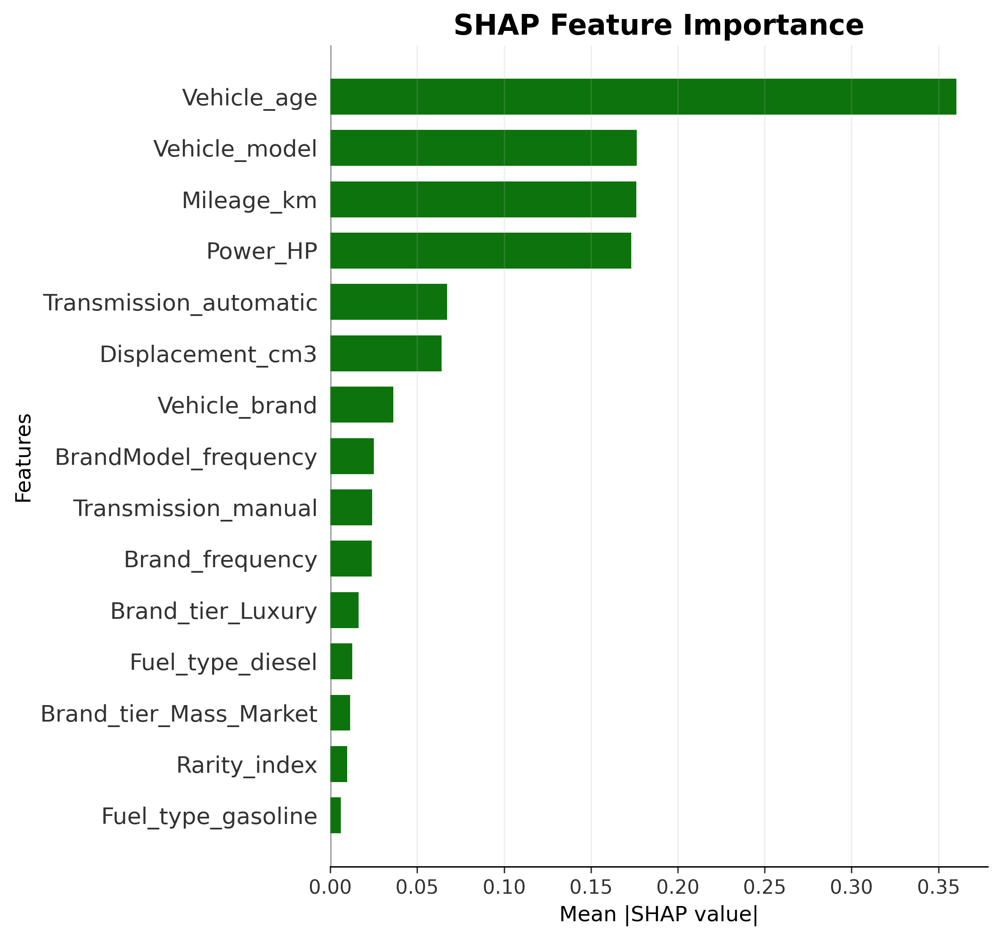

# 🚗 PriceMyRide PL: Car Valuation Engine


## 📌 Project Overview

This repository contains an end-to-end machine learning project focused on predicting used car prices in the Polish automotive market. The objective is to develop a **production-ready pricing engine** capable of estimating the market value of a vehicle based on its technical specifications, usage characteristics, and market context.

The model leverages vehicle attributes such as brand, model, production year, mileage, engine parameters, and equipment features to generate accurate price predictions. By analyzing patterns in historical market data, the system captures complex relationships between vehicle characteristics and their corresponding market prices.

The solution is designed to support **data-driven decision-making** for both professional dealerships and private sellers — enabling competitive listing price estimation, depreciation trend analysis, and identification of key value drivers in the used car market.

This project demonstrates a complete **machine learning workflow**: data preprocessing, feature engineering, model development, hyperparameter optimization, and detailed model evaluation with error analysis. The final model is built using gradient boosting and optimized to provide reliable predictions across a wide range of vehicle types and price segments.

**Project pipeline stages:**

1. **Data loading & preprocessing** — collect, load, and clean raw vehicle listings from Polish online car sales platforms.
2. **Exploratory Data Analysis (EDA)** — analyze feature distributions, detect anomalies and outliers, generate visual insights.
3. **Feature engineering** — handle missing values, encode categorical variables, create derived features, remove extreme outliers.
4. **Model experimentation** — evaluate multiple approaches: linear baseline → Random Forest → optimized XGBoost.
5. **Hyperparameter tuning** — apply **Optuna** (Bayesian search) to identify optimal model configurations.
6. **Evaluation & validation** — assess performance using **RMSE, MAE, MAPE, and R²** with residual analysis.
7. **Error analysis and model refinement** — investigate prediction errors, identify problematic segments, engineer corrective features.
8. **Deployment** — serialize the model to **Hugging Face Hub**, build an interactive **Streamlit dashboard**, containerize with **Docker**.

---

## 🚀 Live Demo & Models

### 🖥️ Streamlit Dashboard
**[Launch App →](https://cars-price-prediction-in-poland-93x3kme8tvdopec5f4vxul.streamlit.app/)**

### 🤗 Hugging Face Model Registry
**[View Models on Hugging Face →](https://huggingface.co/Przemsonn/poland-car-price-model)**

---

## 📚 Table of Contents
1. [Dataset](#-dataset)
2. [Project Structure](#-project-structure)
3. [Workflow Steps](#-workflow-steps)
4. [Data Limitations & Inflation Adjustment](#️-data-limitations--inflation-adjustment)
5. [Results & Business Impact](#-results--business-impact)
6. [Tech Stack](#️-tech-stack)
7. [Installation & Usage](#-installation--usage)
8. [Docker](#-docker)
9. [Future Work](#-future-work)

---

## 📁 Dataset

The raw dataset is stored in `data/Car_sale_ads.csv` and contains **over 200,000 vehicle listings** scraped from popular Polish automotive marketplaces. The most recent listings in the dataset are from **2021**.

Key fields include:

| Category | Fields |
|----------|--------|
| Vehicle information | `brand`, `model`, `year`, `mileage` |
| Technical specs | `fuel_type`, `power_hp`, `type`, `transmission`, `displacement_cm3`, `colour`, `origin_country`, `doors_number`, `first_owner`, `condition` |
| Pricing | `price` (target, PLN or EUR), `currency` |
| Offer details | `registration_date`, `offer_publication_date` |
| Text attributes | `features`, `offer_location` |

> **Note:** Prices in EUR were converted to PLN using official exchange rates from the National Bank of Poland (NBP) API before any analysis or modeling.

---

## 📂 Project Structure

```
├── data/
│   └── Car_sale_ads.csv
├── images/
├── models/
├── notebooks/
├── reports/
│   └── model_evaluation_report.txt
├── src/
│   ├── config.py
│   ├── data.py
│   ├── evaluation.py
│   ├── features.py
│   ├── models.py
│   ├── preprocessing.py
│   ├── utils.py
│   └── visualization.py
├── .gitignore
├── app.py
├── Dockerfile
├── docker-compose.yml
├── LICENSE
├── main.py
├── requirements.txt
└── README.md
```

The `src/` directory contains modular, production-ready scripts that mirror the notebook experiments. `main.py` orchestrates the full pipeline end-to-end. `app.py` is the Streamlit application serving the final model. `Dockerfile` and `docker-compose.yml` enable fully containerized deployment without any local dependency setup.

---

## 🔁 Workflow Steps

### 🗂 Data Loading

The raw dataset is loaded from CSV using `pandas.read_csv` within `src/data.py`. This module centralizes data loading logic, making the dataset consistently accessible across preprocessing, analysis, and training stages. Centralizing this logic also ensures that any future data source changes require modifications in only one place.

---

### 🔧 Data Preprocessing & Quality Assessment

This stage addresses missing values, outliers, data types, and currency standardization while carefully avoiding data leakage. The quality of this step directly determines the ceiling for model performance — garbage in, garbage out applies strongly in pricing models where a single corrupted record (e.g., a price entered in the wrong currency without conversion) can distort predictions for an entire vehicle segment.

Key preprocessing steps:
- **Missing value handling** — median imputation for numerical features (robust to outliers), mode for categorical (preserves the most common market context)
- **Outlier detection** — identified and flagged extreme values in price, mileage, and power; listings with implausible combinations (e.g., 5-year-old car with 900,000 km mileage) were removed as data entry errors
- **Type casting** — ensured consistent dtypes across features before pipeline construction to prevent silent type coercion errors during transformation
- **Currency standardization** — all prices converted to PLN via NBP API; using official exchange rates rather than a fixed approximation ensures the model learns from price relationships that reflect actual purchasing power

> All preprocessing logic is encapsulated in `src/preprocessing.py` and executed as part of the scikit-learn pipeline to prevent data leakage between train and test sets.

---

### 🔍 Exploratory Data Analysis (EDA)

Comprehensive exploratory analysis was conducted to understand the dataset structure, distributions, and key patterns before modeling. The EDA directly informed feature engineering decisions and model selection.

#### Price Distribution & Depreciation


The depreciation curve above plots median vehicle price against production year, revealing three structurally distinct phases in how cars lose value over time.

**Key Insights:**
- **Rapid early depreciation:** ~50% of value lost within the first 5 years — confirms the need for non-linear modeling. This steep initial drop is driven by the transition from "new" to "used" status, warranty expiry, and the first major service intervals. A linear model fundamentally cannot capture this shape.
- **Stable decline:** Between 5–25 years, depreciation follows a consistent downward trend as accumulated mileage and wear become the primary pricing factors, smoothing out brand and segment differences.
- **Classic car effect:** Vehicles older than 25 years show price stabilization or slight increases (collectible/vintage transition), introducing a non-monotonic relationship that required dedicated feature engineering to handle.
- **Log transformation recommended** due to right-skewed price distribution — the long tail of luxury and collectible vehicles would otherwise dominate training loss and cause the model to underfit the mass-market segment that represents the majority of listings.

---

#### Feature Relationships: Key Predictors vs Price


The scatter plots above show the raw relationship between the four strongest numerical predictors and the target price, before any transformation. Each relationship exhibits clear non-linearity, validating the decision to move beyond linear modeling.

| Feature | Relationship | Key Finding |
|---------|-------------|-------------|
| Production Year | Strong positive | Sharp increase post-2015; 2020+ vehicles carry significant premium driven by near-new inventory scarcity during the semiconductor crisis |
| Mileage | Strong negative | Lower mileage = higher price; the relationship is exponential at low mileage (0–30k km) and flattens at very high mileage — most critical depreciation predictor |
| Power (HP) | Positive | Strongest numerical predictor; linear up to ~300 HP, then extreme variance as the luxury and supercar segment introduces brand premium effects that HP alone cannot capture |
| Displacement (cm³) | Moderate positive | Less linear than HP; modern turbocharged engines decouple displacement from performance, making this feature less informative for post-2015 vehicles |

**Modeling impact:** All four features are strong candidates for polynomial features and interaction terms, as their relationships with price are clearly non-linear. The fan-shaped scatter patterns also suggest heteroscedastic variance — another argument for log-transforming the target.

---

#### Interaction Effects: Mileage × Age × Segment


The plot above colors each listing by vehicle age group, revealing that the mileage-price relationship is not universal — it changes dramatically across lifecycle stages. A young car with 50,000 km is priced very differently from a 12-year-old car with the same mileage, even though the raw mileage value is identical. This interaction is one of the most practically important insights from the EDA.

| Age Segment | Mileage Range | Price Range | Notes |
|-------------|--------------|-------------|-------|
| New (<3 years) | 0–20,000 km | 50k–1M PLN | Demo vehicles show slight mileage at premium |
| Recent (3–8 years) | <100,000 km | 50k–300k PLN | Premium brands retain value despite higher mileage |
| Used (9–16 years) | 50k–300k km | <200k PLN | Mass-market segment dominates |
| Old (>16 years) | up to 400k+ km | <50k PLN | Exceptions for vintage/collectible vehicles |

This finding directly motivated the creation of the `age_mileage_interaction` and `mileage_per_year` engineered features described in the Feature Engineering section.

---

#### Fuel Type Price Evolution


The time series above shows average listing price by fuel type across production years, highlighting how different powertrains have tracked different market trajectories. This is particularly relevant for the model because fuel type is not just a technical classification — it also proxies vehicle era, buyer intent, and expected total cost of ownership.

**Key Insights:**
- **Electric vehicles:** Sharp price increase post-2010 reflects both battery technology maturation and a shift from budget EVs to premium positioning (Tesla effect)
- **Hybrid:** Moderate growth in mid-range segment — increasingly present in fleet and family vehicle categories
- **Diesel & Gasoline:** Steady historical increase with some divergence post-2018 as diesel face regulatory headwinds in European markets, including Poland
- **CNG & LPG:** Minimal growth in the cost-sensitive, high-mileage driver segment

Fuel type's inclusion as a feature goes beyond capturing technical differences — it embeds temporal and market-segment information that complements production year and price range.

---

#### Correlation Analysis


The heatmap above quantifies linear relationships between all numerical features and price, and also highlights multicollinearity between predictors — an important diagnostic for deciding which features to engineer, combine, or remove.

**Notable correlations with price:**
- `Power_HP`: **+0.64** — strongest numerical predictor; reflects the well-documented relationship between engine output and vehicle segment
- `Production_year`: **+0.45** — newer = more expensive; partially redundant with `Vehicle_age` (correlation = -0.99 between the two)
- `Vehicle_age`: **-0.45** — the moderate (not strong) negative correlation confirms the non-linear depreciation finding from EDA — old vehicles are not uniformly cheap
- `Displacement_cm3`: **+0.36** — engine size matters, but less so for modern turbocharged vehicles

**Engineering decisions informed by this analysis:**
- `HP_per_liter` created to reduce `Power_HP` ↔ `Displacement_cm3` multicollinearity (r = 0.81) — combining them into a single performance ratio preserves information while reducing redundancy
- `Vehicle_age` used instead of `Production_year` (more interpretable, removes redundancy since their correlation = -1.00)
- Polynomial and interaction terms added for moderate correlations to help the model capture non-linear patterns that linear correlation coefficients systematically underestimate

---

### 🔧 Feature Engineering

Feature engineering was one of the most impactful stages of the project. The goal was to translate domain knowledge about the automotive market into representations the model can learn from effectively. Raw features like production year or mileage carry useful information, but the model learns much more efficiently when that information is expressed in terms that match the underlying pricing logic — for example, how many kilometers a car has been driven per year of its life is more directly informative than mileage alone.

#### Domain-Driven Feature Synthesis

| Feature | Type | Description |
|---------|------|-------------|
| `mileage_per_year`, `usage_intensity` | Operational | Distinguishes highway vs city usage patterns for same-age vehicles — two cars with identical mileage but different ages represent very different depreciation profiles |
| `hp_per_liter` | Performance ratio | Captures modern turbo efficiency vs older naturally-aspirated engines; decouples raw displacement from actual performance output |
| `is_premium`, `is_supercar` | Binary flags | Brand prestige and power thresholds — signals luxury pricing dynamics that cannot be learned from continuous technical specs alone |
| `is_collector` | Binary flag | Vintage vehicles where rarity drives value more than utility; prevents the model from applying standard depreciation logic to cars where the pricing mechanism is fundamentally different |
| `age_category` | Segmentation | Lifecycle stages: New / Standard / Old / Vintage — encodes the structural phases identified in the EDA depreciation curve into an explicit categorical signal |

#### Non-Linear & Interaction Features

- **Polynomial terms:** Squared `vehicle_age`, `power_hp`, `mileage_km` — captures the accelerating early depreciation curve and the premium escalation at high HP values that linear terms cannot represent. Without these, the model would systematically underestimate both the price of new low-mileage cars and the depreciation rate in the first 3–5 years.
- **Interaction terms:** `age_mileage_interaction`, `power_age_interaction` — reflects how the combined effect of these variables differs across segments. A high-mileage car is penalized much more if it is also old, and a high-power car retains more of its premium when it is young.
- **Log transforms:** Applied to highly skewed features (`mileage_km`, `power_hp`, `displacement_cm3`) to stabilize variance and reduce the disproportionate influence of extreme values on gradient-based learning.

#### Preprocessing Pipeline

```
ColumnTransformer
├── Numerical → Median imputation → StandardScaler
├── Low-cardinality categorical → OneHotEncoder
└── High-cardinality categorical → TargetEncoder (smoothing=500)
```

The choice of `TargetEncoder` for high-cardinality features like `model` (hundreds of unique values) is deliberate: one-hot encoding would produce a sparse, extremely wide feature matrix, while label encoding loses ordinal meaning. Target encoding replaces each category with a smoothed estimate of the mean target value — effectively teaching the model what each specific brand/model combination is worth on average, without blowing up the feature space. The smoothing factor of 500 prevents overfitting to rare vehicle models represented by very few listings.

> All transformations are fitted **only on training data** and applied to the test set — no data leakage.

---

### 📈 Model Training & Performance

The modeling phase followed an incremental complexity approach — each step was motivated by the limitations of the previous model. Rather than jumping directly to the most complex algorithm, this progression provides interpretable evidence for each architectural decision and establishes a clear performance baseline at each level.

#### Evaluation Metrics — What They Mean for Car Price Prediction

Before diving into model results, it is worth clarifying what each metric actually represents in this business context:

| Metric | Interpretation for Car Pricing |
|--------|-------------------------------|
| **R²** | Proportion of price variance explained by the model. R² = 0.94 means the model accounts for 94% of the variation in prices across all vehicles — the remaining 6% is due to factors not captured in the data (e.g., vehicle history, negotiation, cosmetic condition). |
| **MAE** (Mean Absolute Error) | Average absolute prediction error in PLN. MAE = 8,000 PLN means predictions are off by 8,000 PLN on average — regardless of whether the car costs 20,000 or 200,000 PLN. Intuitive but treats all errors equally regardless of price level. |
| **RMSE** (Root Mean Squared Error) | Similar to MAE but penalizes large errors more heavily due to squaring. RMSE > MAE always; a large gap between the two indicates the model struggles with certain outlier-prone segments (vintage, supercar). |
| **MAPE** (Mean Absolute Percentage Error) | Scale-independent error as a percentage of actual price. MAPE = 17% means predictions deviate by 17% on average relative to the actual price — a 100,000 PLN car would be predicted within ±17,000 PLN. Most business-interpretable metric for comparing across price segments. |

---

#### Model 1 — Linear Regression (Baseline)

| Metric | Value |
|--------|-------|
| R² | 83.1% |
| MAE | 14,798 PLN |
| RMSE | 34,358 PLN |
| MAPE | 29.3% |

The linear regression baseline establishes the performance floor and confirms what the EDA already suggested: **car depreciation is not a linear process**. An R² of 83.1% sounds reasonable in isolation, but the MAE of nearly 15,000 PLN and MAPE of 29.3% translate to predictions that are commercially unusable — a car worth 50,000 PLN could be priced anywhere between 35,000 and 65,000 PLN. The model fails particularly hard on vehicles at the extremes of the age and price distribution, where the non-linear depreciation curve deviates most from any linear approximation. This baseline serves as a reference floor — every subsequent model is evaluated against this starting point.

---

#### Model 2 — Random Forest

| Metric | Value |
|--------|-------|
| R² | 93.8% |
| MAE | 8,410 PLN |
| RMSE | 20,799 PLN |
| MAPE | 20.0% |

Switching to Random Forest delivered substantial gains across all metrics: MAE dropped by ~43% and MAPE fell from 29.3% to 20.0%. This confirms that **non-linear decision boundaries** are essential for this problem — the model now captures depreciation thresholds (e.g., the sharp price drop when a car crosses 100,000 km or 10 years of age) that linear regression missed entirely. The R² of 93.8% represents a meaningful improvement in explained variance. However, the remaining MAPE of 20% still represents significant commercial uncertainty — a car priced at 80,000 PLN could be predicted anywhere within a ±16,000 PLN window. The Random Forest also struggled with luxury and vintage segments where training examples are scarce: without enough examples to form reliable decision trees in those regions, the model defaults to regression toward the mean, systematically underestimating high-value vehicles. This limitation motivated the move to gradient boosting.

---

#### Model 3 — XGBoost (Base) ⭐ Selected for deployment

| Metric | Train | Test |
|--------|-------|------|
| R² | 92.5% | 94.1% |
| RMSE | 24,494 PLN | 19,982 PLN |
| MAE | 6,711 PLN | 7,928 PLN |
| MAPE | 13.4% | 16.8% |

The base XGBoost model achieves the best overall performance across all metrics and was selected for production deployment. The MAE of 7,928 PLN represents a 45.5% reduction compared to the linear baseline and a ~6% improvement over Random Forest. The MAPE of 16.8% means the model is commercially usable for most vehicle segments — on a 60,000 PLN car, predictions are within approximately ±10,000 PLN on average, which aligns with the natural price spread visible on marketplaces like Otomoto for similar specifications.

One notable observation is that test R² (94.1%) is marginally higher than train R² (92.5%). This is unusual but explainable: the test split likely captured proportionally fewer extreme outliers (luxury and vintage vehicles), resulting in a slightly easier prediction problem on average. There are no signs of overfitting — training and test RMSE are within ~4,500 PLN of each other, well within normal variance.

##### XGBoost Feature Importance


The feature importance chart above shows the relative contribution of each feature to the model's split decisions. Several findings stand out:

- **Is_new_car (41%):** The single most critical predictor. The "new car" binary flag captures the structural price discontinuity between brand-new and used vehicles — a distinction that cannot be expressed continuously through production year or mileage alone. This aligns with the sharp depreciation cliff observed in the EDA.
- **Vehicle_age_squared (21%) + Vehicle_age (8%):** Together, the age-related features account for ~29% of the model's logic, and the squared term outweighs the linear term — direct confirmation that the model has learned the non-linear depreciation curve. Had only linear age been included, this ~21% of predictive power would have been left on the table.
- **Transmission (10%):** Automatic gearboxes carry a consistent premium in the Polish market, particularly in the 3–10 year age bracket. This feature captures both the technical characteristic and the buyer preference signal embedded in it.
- **Engine Power (3–5%):** Relatively modest individual importance, but note that power also contributes indirectly through the `is_supercar`, `hp_per_liter`, and `power_age_interaction` features — the total effect of engine performance on the model is higher than any single feature's importance suggests.

**Why XGBoost outperforms Random Forest here:**
- Sequential boosting focuses correction on residuals from previous trees — particularly effective for the diverse price range in this dataset where high-value vehicles are systematically underestimated by a single-pass ensemble
- More sensitive to the engineered interaction features, which carry gradient signal across multiple splits
- Better handles the log-transformed target variable, as boosting can progressively reduce residuals in both tails of the distribution

---

#### Model 4 — XGBoost (Hyperparameter-Tuned via Optuna)

| Metric | Value |
|--------|-------|
| R² | 92.9% |
| MAE | 8,078 PLN |
| RMSE | 22,282 PLN |
| MAPE | 17.2% |

This model was developed as an attempt to push beyond the base XGBoost results by combining hyperparameter optimization with additional feature engineering. Three new brand-related features were introduced — `Brand_frequency`, `Brand_category`, and `Brand_popularity` — specifically to help the model differentiate pricing dynamics for niche, rare, and luxury manufacturers that appear infrequently in the training data. Hyperparameter tuning was performed using Optuna with 50+ Bayesian search trials, applying strong regularization via Gamma, Alpha, and Lambda penalties.

Despite this additional engineering effort, all metrics deteriorated slightly compared to the base model. The most likely explanation is that the strong regularization introduced more bias than the variance reduction justified — the base XGBoost already generalized well, and further penalizing model complexity reduced its ability to fit the legitimate non-linear patterns in the data. The additional brand features may also have introduced mild noise: brand popularity is a proxy for segment, which was already captured through `is_premium` and `is_supercar` flags.

##### SHAP Feature Importance



SHAP (SHapley Additive exPlanations) values provide a more theoretically rigorous measure of feature importance than the split-based XGBoost importance shown above. While split importance counts how often a feature is used in tree splits, SHAP quantifies the average magnitude of each feature's contribution to individual predictions — capturing both direct and indirect effects. This makes SHAP particularly useful for validating that the model's behavior aligns with real-world pricing intuition.

The most influential features align with real-world intuition:
- **Vehicle Age** (SHAP ≈ 0.55): Dominant predictor by a significant margin, consistent with the depreciation curve from EDA. The high SHAP value means that knowing a car's age moves the model's price estimate substantially — more than any other single input.
- **Power (HP)** (SHAP ≈ 0.18): Reflects the luxury and performance premium embedded in high-output vehicles. The gap between age and HP confirms that time-based depreciation is the primary pricing mechanism, with technical performance as a secondary modifier.
- **Vehicle Model** (SHAP ≈ 0.15): Captures brand and model-specific pricing patterns not visible in aggregate statistics — for example, why a 5-year-old Golf and a 5-year-old Audi A4 are priced differently even at the same mileage and power.
- **Mileage (km)** (SHAP ≈ 0.12): Strong depreciation signal, ranking fourth despite being intuitively important. This reflects the fact that mileage is already partially captured through `mileage_per_year` and the interaction features — its standalone SHAP value is somewhat distributed across related features.

Vehicle Type and Fuel Type contribute minimally (SHAP 0.01–0.03), confirming that technical performance metrics outweigh body style in price determination for this market.

**Decision: Base XGBoost (Model 3) selected** — best predictive accuracy with stable generalization. The tuned model's additional complexity did not translate to real-world performance gains on this dataset.

---

#### 🛠 Error Analysis


The residual plot above shows prediction errors broken down by production year. Mass-market vehicles produced between 2000 and 2021 show low, symmetric residuals centered near zero — the model performs consistently well across this dominant segment. The most visible error concentration appears for vehicles at the extremes of the production year range.

The largest prediction errors occur for:
- **Vintage vehicles (pre-1980):** RMSE ~59,301 PLN — approximately 3× higher than for newer cars. These vehicles are priced by rarity, collector demand, and restoration quality rather than technical specifications, which cannot be fully captured from structured data alone. The model has limited training examples in this range, and the features used (age, mileage, power) carry a fundamentally different meaning for collector vehicles than they do for utility cars.
- **Luxury & supercar segment** (Lamborghini, Aston Martin, Rolls-Royce): Underrepresented in training data at fewer than 0.5% of all listings. The model tends to underestimate prices in this category, as it has insufficient examples to learn the brand prestige multiplier at extreme price points.

Mass-market vehicles (VW, Toyota, Opel, Škoda) remain well-predicted with low residuals across the full mileage and age range. These niche segments were **intentionally retained** rather than removed — excluding them would artificially inflate metrics without improving real-world utility. The application correctly warns users when a predicted vehicle falls into a high-uncertainty category, providing appropriate transparency about prediction confidence.

---

#### 📊 Learning Curves


The learning curves above plot training and validation performance as a function of training set size. They serve as a diagnostic tool for understanding whether the model would benefit from more data or whether architectural changes are needed.

The curves confirm a healthy bias–variance balance:
- Training and validation curves converge smoothly — minimal overfitting gap at the full training set size
- The gap between curves narrows steadily as training set size increases — stable learning behavior with no sign of divergence
- A plateau is visible beyond ~150,000 samples — additional data alone is unlikely to substantially improve performance without introducing new feature types, such as NLP-derived features from listing descriptions. This suggests the model has extracted most of the available signal from the current feature set.

---

#### 🏁 Model Comparison


| Model | R² | MAE | MAPE | Decision |
|-------|----|-----|------|----------|
| Linear Regression | 83.1% | 14,798 PLN | 29.3% | ❌ Baseline only |
| Random Forest | 93.8% | 8,410 PLN | 20.0% | ✅ Strong but surpassed |
| **XGBoost Base** | **94.1%** | **7,928 PLN** | **16.8%** | ⭐ **Selected** |
| XGBoost Tuned | 92.9% | 8,078 PLN | 17.2% | ⚠️ Slightly worse |

**Conclusions:**

The progression from Linear Regression to XGBoost Base tells a clear story about this problem's nature. The 10+ percentage point jump in R² from linear to tree-based models confirms that non-linearity is not an optional enhancement — it is a fundamental requirement for modeling vehicle depreciation. The move from Random Forest to XGBoost delivered a further improvement in MAE (8,410 → 7,928 PLN) and a more significant drop in MAPE (20.0% → 16.8%), with the gradient boosting framework's ability to iteratively correct residuals proving particularly valuable for the wide price range present in this dataset.

The Tuned XGBoost result is the most instructive: despite 50+ optimization trials and additional feature engineering, performance regressed slightly across all metrics. This is a reminder that hyperparameter tuning is not a guaranteed improvement — when a model already generalizes well, increased regularization can reduce its capacity to fit legitimate signal. The base XGBoost configuration found the right balance between bias and variance without needing aggressive penalization.

For practical deployment, a MAPE of 16.8% and MAE of ~7,900 PLN means the model is well-suited for mass-market vehicle valuation (cars in the 20,000–150,000 PLN range) and can serve as a strong pricing signal for dealerships and private sellers alike. The residual 16.8% error reflects a mix of true model uncertainty, the inherent noise in online listing prices (negotiation margins, seller motivation), and the unmodeled quality of individual vehicles.

---

## ⚠️ Data Limitations & Inflation Adjustment

The dataset contains listings up to **2021**. To align predictions with current (2026) market prices, an **age-based inflation factor** is applied automatically in the application. A single flat factor was rejected in favor of segmented adjustment because different vehicle age groups experienced significantly different price dynamics during 2021–2026 — near-new vehicles were heavily affected by the semiconductor shortage and resulting new car delivery delays, while older budget-segment vehicles tracked closer to general CPI.

| Vehicle Age (as of 2021) | Factor | Rationale |
|--------------------------|--------|-----------|
| ≤ 3 years (2019–2021) | ×1.45 | Semiconductor crisis 2021–2023 drove near-new prices up 40–60% |
| 4–8 years (2013–2018) | ×1.37 | Most liquid segment; tracked standard market growth |
| 9–15 years (2006–2012) | ×1.25 | Budget segment; price-sensitive buyers dampened growth |
| 16–30 years (1991–2005) | ×1.15 | Niche market; lower demand elasticity, closer to CPI |
| >30 years (pre-1991) | ×1.05 | Collector market; independent pricing dynamics |

*Sources: autobaza.pl, Otomoto Market Report 2022, magazynauto.pl, NBP CPI data 2021–2026*

Additionally, the Otomoto search link shown after each prediction is adjusted by **+5 years** (2021→2026), so that the listings displayed reflect the **current equivalent age** of the predicted vehicle rather than the original production year. This allows users to directly cross-check the inflation-adjusted prediction against live market listings.

> **Production year cap:** The application limits predictions to vehicles manufactured up to 2021, as these are the only years present in the training data. Predictions for post-2021 vehicles would be extrapolations with no training support.

---

## 🚀 Deployment

- **Model Serialization:** Final model saved with `joblib.dump` and hosted on Hugging Face Hub for versioned storage and reproducibility.
- **Streamlit App:** Users input vehicle specs and receive real-time price predictions with inflation adjustment, vehicle summary stats, and a direct Otomoto search link.
- **Deployment:** Streamlit Community Cloud (live link at the top of this README).
- **Docker:** The full application is containerized for reproducible local deployment — see the [Docker section](#-docker) below.
- **Evaluation report:** Key metrics and model diagnostics saved as `reports/model_evaluation_report.txt`.

### Application Interface


The app contains four sections accessible via sidebar navigation:
- **Price Prediction** — main valuation tool with inflation-adjusted output and Otomoto link
- **Regional Market** — interactive map of listing distribution across Poland
- **Data Visualizations** — EDA charts with explanations
- **About Model** — model selection rationale, metrics, and limitations


---

### Example Prediction — Hyundai i20


Comparable vehicles on the Polish market (similar year, mileage, power) typically sell between **30,000–40,000 PLN**. The model's prediction falls within this range, confirming strong performance for mass-market vehicles.


---

### Example Prediction — Mercedes-Benz C-Class


The model estimates approximately **132,000 PLN** — consistent with current Otomoto listings for comparable C-Class specifications from around 2023.


The Otomoto link is automatically generated with filters matching the predicted vehicle's adjusted year, mileage range, and price range — allowing users to immediately validate the prediction against real market listings.


---

## 📊 Results & Business Impact

**Base XGBoost (Model 3)** was selected for deployment due to its best predictive accuracy and stable generalization across diverse vehicle segments.

| Improvement vs Baseline | Value |
|-------------------------|-------|
| MAE reduction | **45.5%** (14,798 → 7,928 PLN) |
| MAPE reduction | **42.7%** (29.3% → 16.8%) |
| R² improvement | +11.2 pp (83.1% → 94.3%) |

**Business applications:**
- **Dealership pricing:** Automated competitive price estimation at scale — reduces manual appraisal time and introduces consistency across valuation teams
- **Inventory valuation:** Consistent, data-driven vehicle appraisal across large fleets — replaces reliance on individual appraiser intuition
- **Depreciation forecasting:** Informs purchase timing and resale strategy decisions by quantifying expected value loss over time
- **Marketplace integration:** Architecture is REST API-ready for integration into listing platforms, enabling real-time price suggestions at the moment of listing creation

---

## 🛠️ Tech Stack

| Category | Tools |
|----------|-------|
| ML & modeling | XGBoost, scikit-learn, category-encoders |
| Optimization | Optuna (Bayesian hyperparameter search) |
| Data processing | Pandas, NumPy |
| Visualization | Matplotlib, Seaborn, Plotly |
| Geospatial | Folium, streamlit-folium |
| Deployment | Streamlit, Hugging Face Hub |
| Containerization | Docker, Docker Compose |
| Serialization | Joblib |
| External APIs | NBP (currency conversion) |

---

## 📥 Installation & Usage

1. **Clone the repository:**
   ```bash
   git clone https://github.com/Przemsonn05/Car-Price-Prediction.git
   cd Car-Price-Prediction
   ```

2. **Install dependencies:**
   ```bash
   pip install -r requirements.txt
   ```

3. **Run the full pipeline (optional — model is pre-trained on Hugging Face):**
   ```bash
   python main.py
   ```

4. **Launch the Streamlit app:**
   ```bash
   streamlit run app.py
   ```

5. Inspect `notebooks/` for step-by-step experiment documentation and exploratory analysis.

---

## 🐳 Docker

The project is fully containerized using Docker, enabling reproducible deployment without any local Python environment setup. The image is built on `python:3.11-slim` and runs the Streamlit app as a non-root user (`myuser`) for security. The layer order in the `Dockerfile` is intentional — `requirements.txt` is installed before the application code is copied, so Docker's build cache is preserved between code changes and rebuilds take seconds rather than minutes.

### Prerequisites

- [Docker](https://docs.docker.com/get-docker/) installed and running
- [Docker Compose](https://docs.docker.com/compose/install/) (included with Docker Desktop on Windows/macOS)

### Running with Docker Compose (recommended)
```bash
# Build the image and start the container
docker compose up --build

# Open the app at http://localhost:8501
```

The `--build` flag is only needed on the first run or after modifying `requirements.txt` or the `Dockerfile`. On subsequent runs:
```bash
docker compose up
```

To stop and remove the container:
```bash
docker compose down
```

### Running with Docker directly
```bash
docker build -t car-price-prediction .
docker run -p 8501:8501 car-price-prediction
```

### Volumes and environment

The `docker-compose.yml` mounts two local directories into the container:

| Host path | Container path | Purpose |
|-----------|---------------|---------|
| `./data`    | `/app/data`    | Raw dataset (`Car_sale_ads.csv`) |
| `./reports` | `/app/reports` | Model evaluation output |

The pre-trained model is downloaded from Hugging Face Hub at startup — no local model file is required. An internet connection is needed on first launch.

> **Note:** The `models/`, `images/` and `notebooks/` directories are excluded from the image via `.dockerignore` to keep the image size minimal.

---

## 🔮 Future Work

- **Up-to-date data:** Scrape current listings to retrain on post-2021 market data and eliminate the need for the inflation adjustment entirely. This is the single highest-impact improvement available.
- **NLP features:** Use Polish-language BERT to extract pricing signals from listing descriptions (e.g., detecting AMG packages, accident history mentions, special equipment not captured in structured fields).
- **Ensemble strategies:** Experiment with stacking XGBoost alongside LightGBM or CatBoost for potentially lower MAPE on outlier segments, particularly vintage and luxury vehicles where gradient boosting's residual correction could be amplified through a meta-learner.
- **REST API:** Wrap the model in a FastAPI endpoint for integration into dealer platforms and automated listing tools — enabling programmatic access beyond the Streamlit UI.
- **CI/CD pipeline:** Add GitHub Actions for automated retraining when new data becomes available, with quality gates that prevent degraded models from being promoted to production.

---

<div align="center">

**⭐ If you found this project helpful, please star the repository!**

[](https://github.com/Przemsonn05/Cars-Price-Prediction-in-Poland)

</div>
